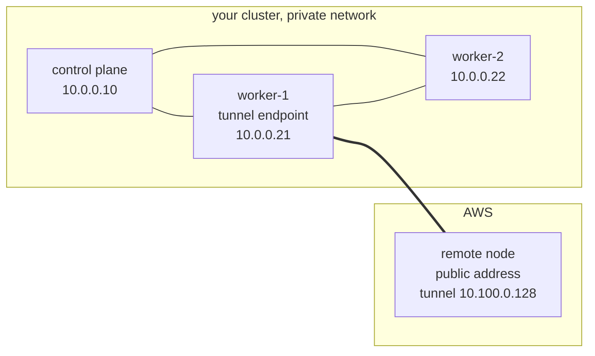
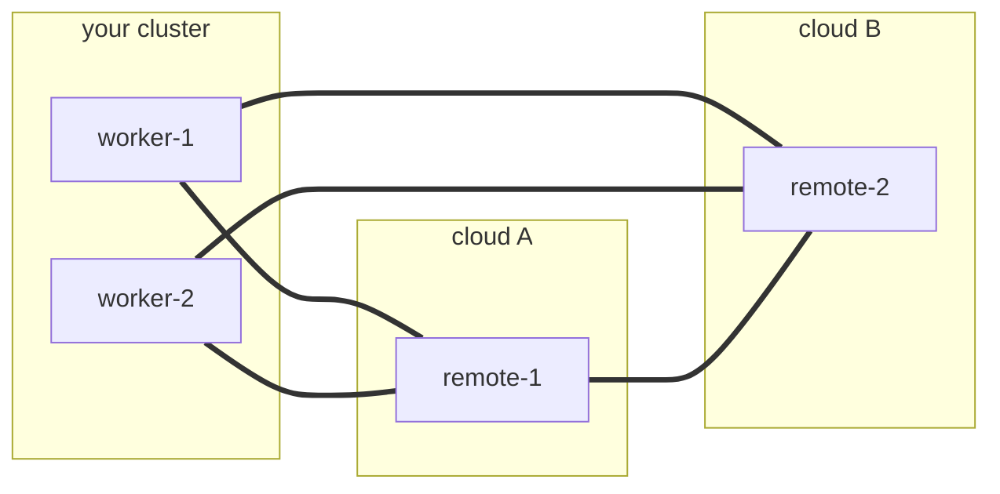
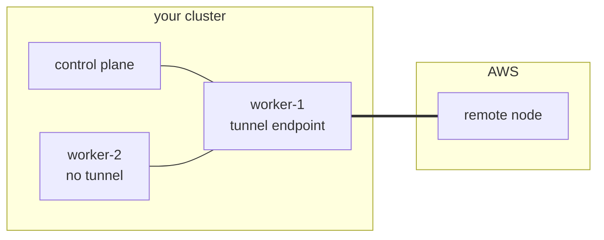

# cloud-provisioning

[](https://github.com/orgs/AppMana/packages?repo_name=cloud-provisioning)

Join a public cloud node to an on-premises, firewalled cluster over a
WireGuard tunnel, so the cluster can run internet-facing workloads such
as an ingress gateway on a node the internet can reach, while the
control plane stays private.

The node joins as an ordinary worker. It is labelled
cloud-provisioning.appmana.com/role=cloud-worker and tainted
cloud-provisioning.appmana.com/internet-facing:NoSchedule, so nothing
lands on it unless you say so. Pod networking is the cluster's own CNI
carried over the tunnel, with no second overlay.

## Deploying it

You need [Cluster API](https://cluster-api.sigs.k8s.io/user/quick-start),
core plus the infrastructure provider for your cloud, and
[cert-manager](https://cert-manager.io/docs/installation/), which
Cluster API requires. If the cluster has Windows nodes, set
deployment.nodeSelector on the Provider resources, because the upstream
manifests carry no OS selector of their own.

Install those and the chart once per cluster:

```bash
clusterctl init --infrastructure aws

helm install cloud-provisioning oci://ghcr.io/appmana/charts/cloud-provisioning \
  --namespace cloud-provisioning --create-namespace \
  --set tunnel.endpoints='kubernetes.io/hostname=worker-1'
```

Also once per cluster, apply the Cluster API objects that describe the
cluster and the cloud account. They are not part of this chart, which
owns only its own resources. A complete set is in
[examples/aws.yaml](examples/aws.yaml).

Then, for each node you want, a machine template and a claim naming it.
This pair is the only thing you repeat:

```yaml
apiVersion: infrastructure.cluster.x-k8s.io/v1beta2
kind: AWSMachineTemplate
metadata:
  name: public-worker
  namespace: cloud-provisioning
spec:
  template:
    spec:
      instanceType: t3.micro
      ami:
        id: ami-0123456789abcdef0
      subnet:
        id: subnet-0123456789abcdef0
      additionalSecurityGroups:
        - id: sg-0123456789abcdef0
      publicIP: true
---
apiVersion: cloud-provisioning.appmana.com/v1alpha1
kind: ProvisionedNodeClaim
metadata:
  name: public-worker
  namespace: cloud-provisioning
spec:
  infrastructureRef:
    apiGroup: infrastructure.cluster.x-k8s.io
    kind: AWSMachineTemplate
    name: public-worker
  clusterName: my-cluster
```

The template carries the whole machine, including the security group
admitting UDP 51820, so a provisioned node is reachable because its
template says it is, not because someone opened a port afterwards.

Watch it arrive, then schedule something onto it:

```bash
kubectl -n cloud-provisioning get provisionednodeclaim -w
kubectl get nodes -l cloud-provisioning.appmana.com/role=cloud-worker
```

```yaml
tolerations:
  - key: cloud-provisioning.appmana.com/internet-facing
    operator: Exists
    effect: NoSchedule
nodeSelector:
  cloud-provisioning.appmana.com/role: cloud-worker
```

Deleting the claim destroys the instance and removes the node:

```bash
kubectl -n cloud-provisioning delete provisionednodeclaim public-worker
```

Beyond tunnel.endpoints there is little to configure, and deliberately
so. The API server address comes from the endpoints of the kubernetes
service, and the pod addressing comes from the network's own per-node
records, re-read every pass, so there is no second copy of any of it to
drift.

tunnel.endpoints says which of your nodes terminate tunnels. It takes a
label selector, a set such as kubernetes.io/hostname in (worker-1,
worker-2), or the word all. Empty means all. Control planes are left
out unless the selector names them, so a tunnel cannot cost a control
plane its default route, and nodes this operator provisioned are never
included, since they are the far end of a tunnel rather than one of
your ends of it.

The remaining values matter only in specific cases. A remote node has
no image puller before it joins, so dialerBinary gives it a first-boot
binary by URL and digest; a URL without its digest is refused. If the
cluster's CNI configuration chains plugins a stock cloud image lacks,
such as bandwidth, cniPlugins supplies them the same way. There is an
optional Cluster API subchart, but a separate release is better,
because coupling the lifecycles lets a failed upgrade here delete the
provider namespaces.

## What happens

Suppose you run a k0s cluster on your own hardware, with Calico for
networking, and you want a worker in AWS. Your control planes have
private addresses and nothing on the internet can reach them. You
install the chart, selecting one worker to terminate tunnels, and
commit the two objects above.

The controller reads what it needs from the cluster: the API server
address, and which pod blocks belong to which node from Calico's own
records. The claim becomes a Cluster API Machine and an AWSMachine
built from your template, the kind taken from the template's kind with
the Template suffix removed. It generates a WireGuard identity for the
new node and renders its cloud-init: the peer list, the join token, and
a digest-pinned dialer binary.

AWS launches the instance. It boots, reads its own architecture,
fetches the matching binary, checks the digest, and brings up the
tunnel. Your worker dials out to it; the instance only listens, because
it is the side with a public address. It waits until the API server
answers through the tunnel and then runs k0s worker with its token,
which is the only path it has, so it cannot join any other way.

The node registers with the cloud-worker label and the internet-facing
taint. The controller tells Calico which address to peer on for it: its
tunnel address, since the instance's own address belongs to AWS and
means nothing to your cluster. It does the same in reverse for the node
holding the tunnel, pinning it to the address its own neighbours reach
it by, so bringing up a tunnel cannot cost a node the network it
already had. Calico then establishes a session across the tunnel and
distributes pod routes.

Your ingress gateway, tolerating the taint, schedules onto the new node
and serves the internet from an address the internet can reach. Your
control plane never leaves the private network.

## The tunnel

The tunnel carries reachability between nodes and nothing else. The
dialer installs host routes only, a /32 or a /128 per peer address, and
anything broader is refused when the peer list is parsed.

WireGuard's cryptokey accept list decides which key may encrypt a
packet. It is not a source of routes. Each peer is permitted its own
node's addresses and the pod blocks that node owns, and nothing else,
because the list is a trie with one owner per prefix: a range shared
between two peers belongs to whichever was written last, and traffic
for it follows whichever that happened to be. No service range is
permitted anywhere, since a service address is translated to a backing
pod on the sending node before anything is routed, so a packet crossing
the tunnel is already addressed to a pod or to a node.

Routing to pods stays the network's job, over the sessions those host
routes make possible.



The thick line is the tunnel. worker-1 dials out to the remote node,
which listens. Nothing dials inward to your network, and no other node
grows a tunnel interface.

Three rules follow from carrying only host routes. A peer's own
endpoint is never routed through the tunnel, because the encrypted
packet's outer destination would match that route and it would
encapsulate itself forever. Routes are pruned as well as added, so a
route that becomes wrong stops black-holing traffic. And a peer's
routes are installed only once it is reachable, meaning its endpoint is
known or a handshake has been seen, because a route to an unreachable
peer is a black hole.

More than one node can terminate tunnels, and more than one remote node
can join. Every selected node dials every remote node, and remote nodes
dial each other, since two nodes in different clouds share no private
network and have no other way to meet.



Each node holds one interface with one peer entry per counterpart, so
the mesh costs one interface per node rather than one per pair. The
interface is named from the identity of the peer list, so it is the
same on every member and never collides with a wg0 or a Tailscale
interface the node already has.

## Nodes that hold no tunnel

Most nodes hold no tunnel, and they still have to reach a remote node's
pods. They cannot manage it alone: a remote node is known by its tunnel
address, and a node with no tunnel has no route to that, so it cannot
even open a session to the remote to learn anything from it.

So a node that does hold a tunnel tells the others. It speaks BGP to
the rest of the site, on a port of its own because a network that
speaks BGP already has something on 179, and advertises the remote
nodes and their pod blocks with itself as the next hop. The site's own
router receives them like any other route, which leaves the choice
between two endpoints, and the withdrawal when a remote goes away,
where they belong.

Both are advertised, and the blocks are not redundant. A router will
not resolve one BGP route's next hop using another BGP route, since
that is how resolution loops form. The node address arrives that way,
so the blocks behind it would stay unreachable however well the address
underneath them is routed. Carrying the blocks too, with the endpoint
as the next hop, resolves them against a directly connected address and
asks nothing of recursion.



worker-2 sends to a remote pod by way of worker-1, which forwards it
into the tunnel. The tunnel carries traffic belonging to neither of the
two nodes holding it, in both directions, which is what makes this work
at all.

## Layout

```
controller/               endpoint-controller (claim, join and mesh) and the dialer
controller/pkg/join/      one package per specialization: k0s and kubeadm for
                          joining, aws and docker for fulfillment
controller/pkg/discover/  reads the cluster's own API addresses
controller/pkg/cni/       recognises the network and reads each node's pod blocks
controller/pkg/tunnel/    the wire contract shared by every producer and consumer
join-patterns/            cloud-init templates, one per join mechanism
charts/                   the Helm chart
examples/                 a complete set of manifests
harness/health-check.sh   every pair of nodes, by pod address and by service address
harness/netns-routing/    single-NIC routing end to end for the dialer
harness/kind-e2e/         one claim becomes a real joined node over a real tunnel
harness/vm-single-nic/    real VM, real boot and reboot
```
