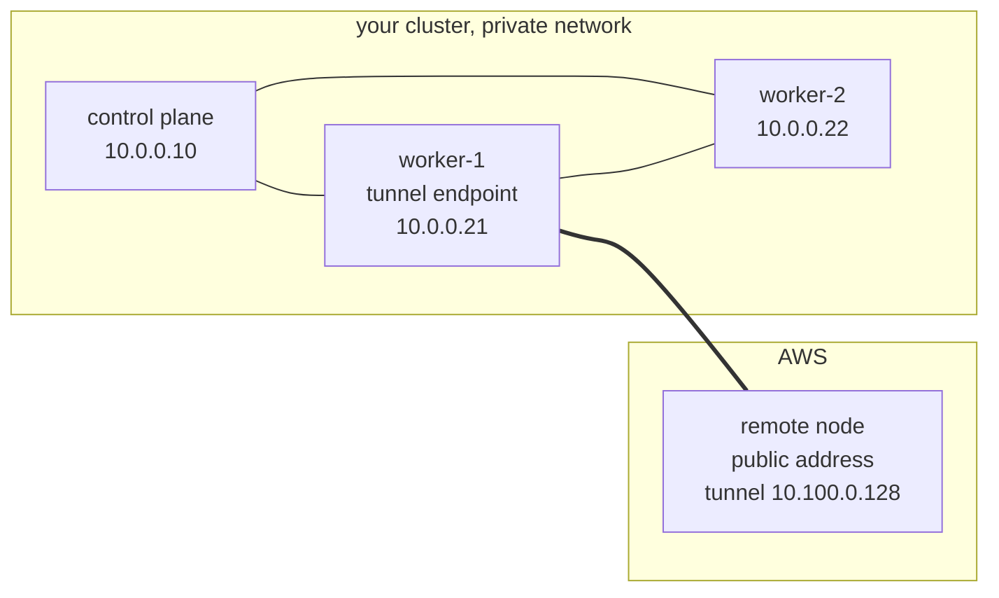
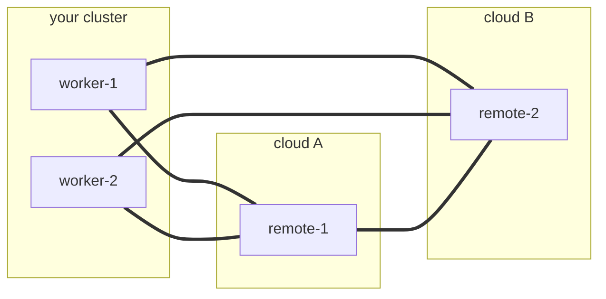
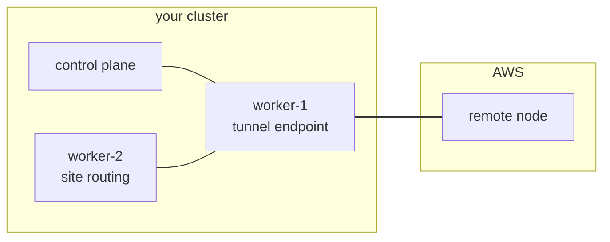

# cloud-provisioning

[](https://github.com/orgs/AppMana/packages?repo_name=cloud-provisioning)

Join a public cloud node to an on-premises, firewalled cluster over a
WireGuard tunnel, so the cluster can run internet-facing workloads such
as an ingress gateway on a node the internet can reach, while the
control plane stays private.

The node joins as an ordinary worker with:

- Label: `cloud-provisioning.appmana.com/role=cloud-worker`.
- Taint: `cloud-provisioning.appmana.com/internet-facing:NoSchedule`.
- Pod networking: the cluster's CNI carried over WireGuard.

Workloads select the worker and tolerate its taint to run there.

## Use cases

### External load balancing

Run an ingress controller or Gateway API data plane on a public cloud worker,
with application pods and control planes on premises. Public DNS points to the
worker's address. The gateway terminates TLS and forwards requests to Service
backends through the tunnel.

- Provision the worker with the AWS template and claim below.
- Allow the gateway's listener ports, usually TCP 80 and 443, in its security group.
- Configure the gateway Deployment to select the cloud-worker label and tolerate
  the internet-facing taint.
- Expose listeners using the gateway's supported host-port, host-network, or
  NodePort configuration. Provisioning a worker provides compute and connectivity;
  a cloud-managed load balancer requires its own controller and cloud resources.
- For redundancy, run gateways on multiple workers and configure external health
  checks and DNS or a cloud load balancer to select healthy addresses.

### Scalable workers

Queue-driven rendering, video processing, and batch jobs can use cloud capacity
when local workers are busy. Bake drivers and runtime dependencies into the image
so paid GPU time goes toward work. See [GPU workers](docs/gpu-workers.md).

[KEDA can scale a worker Deployment](examples/keda-workers.yaml) from a queue-depth
metric. Today, provision its node capacity with individual `ProvisionedNodeClaim`
objects. Workload replicas and machine capacity have separate lifecycles: queued
pods wait while machines boot, and node removal must allow active work to finish.

An experimental `ProvisionedNodeGroupClaim` defines integer `spec.replicas` and a `/scale`
endpoint for capacity scaling. It owns individual claims and reuses their
provider-specific provisioning and teardown. The [group-claim design and
implementation plan](docs/node-groups.md) covers KEDA, scale-to-zero, draining,
and stable child identities. Group UID labels let workloads select their pool;
[the scheduling example](docs/node-groups.md#selecting-a-worker-group) shows the Node
selector and cloud-worker toleration. This API is under development.

## Deploying it

You need [Cluster API](https://cluster-api.sigs.k8s.io/user/quick-start),
core plus the infrastructure provider for your cloud, and
[cert-manager](https://cert-manager.io/docs/installation/), which
Cluster API requires. If the cluster has Windows nodes, set
`deployment.nodeSelector` on the Provider resources to select Linux hosts.

Install those and the chart once per cluster:

```bash
clusterctl init --infrastructure aws

helm install cloud-provisioning oci://ghcr.io/appmana/charts/cloud-provisioning \
  --namespace cloud-provisioning --create-namespace \
  --set providerManagerNamespace=capa-system \
  --set tunnel.endpoints='kubernetes.io/hostname=worker-1'
```

Also once per cluster, apply the Cluster API objects that describe the
cluster and the cloud account. Manage these separately from the chart. The object relationships are in
[examples/aws.yaml](examples/aws.yaml). Follow [AWS provisioning and IAM](docs/aws.md)
for role policies, credentials, infrastructure requirements and cleanup.

After that setup, apply an `AWSMachineTemplate` once per machine configuration
and a `ProvisionedNodeClaim` for each worker. Multiple claims can share one
template. A claim triggers instance creation from its template. Apply both objects
in the referenced CAPI Cluster’s namespace using `kubectl` or your GitOps controller.
See [add, remove and replace an AWS worker](docs/aws.md#add-an-aws-worker) and
the [worker-only manifest](examples/aws-worker.yaml).

```yaml
apiVersion: infrastructure.cluster.x-k8s.io/v1beta2
kind: AWSMachineTemplate
metadata:
  name: public-worker
  namespace: cloud-provisioning
spec:
  template:
    spec:
      instanceType: t3.large
      iamInstanceProfile: cldt-example-node
      sshKeyName: ""
      additionalTags:
        cloud-provisioning-test: cldt-example
      cloudInit:
        insecureSkipSecretsManager: false
      ami:
        id: ami-0123456789abcdef0
      subnet:
        id: subnet-0123456789abcdef0
      additionalSecurityGroups:
        - id: sg-0123456789abcdef0
      publicIP: true
      rootVolume:
        size: 40
        type: gp3
        encrypted: true
---
apiVersion: cloud-provisioning.appmana.com/v1alpha1
kind: ProvisionedNodeClaim
metadata:
  name: public-worker-1
  namespace: cloud-provisioning
spec:
  infrastructureRef:
    apiGroup: infrastructure.cluster.x-k8s.io
    kind: AWSMachineTemplate
    name: public-worker
  clusterName: my-cluster
```

The template specifies the instance configuration, including a security group
admitting UDP 51820 from the tunnel endpoints.

Watch it arrive, then schedule something onto it:

```bash
kubectl -n cloud-provisioning get provisionednodeclaim -w
kubectl get nodes -l cloud-provisioning.appmana.com/role=cloud-worker
```

```yaml
tolerations:
  - key: cloud-provisioning.appmana.com/internet-facing
    operator: Exists
    effect: NoSchedule
nodeSelector:
  cloud-provisioning.appmana.com/role: cloud-worker
```

Delete the claim to destroy the instance and remove the node. For Windows
workers using a gateway attachment, complete
[attachment withdrawal](docs/windows-gateway.md#enable-the-aws-attachment-controller)
first so shared routes and other workers remain usable.

```bash
kubectl -n cloud-provisioning delete provisionednodeclaim public-worker-1
```

Configuration comes from the cluster and the chart:

- `tunnel.endpoints` selects the nodes that terminate tunnels. It accepts a label
  selector or `all`; an empty value also selects all eligible nodes. Control
  planes require an explicit selection. Provisioned cloud workers are excluded.
- API addresses come from the `kubernetes` Service endpoints.
- Pod addresses come from the CNI's per-node records, refreshed each reconciliation.
- `dialerBinary` supplies a first-boot binary URL and its required digest.
- `cniPlugins` supplies additional plugins, such as `bandwidth`, when the cluster
  requires them and the machine image needs them.

Escape commas in a set selector passed through Helm:

```bash
--set-string tunnel.endpoints='kubernetes.io/hostname in (worker-1\,worker-2)'
```

Install Cluster API in a separate release to manage its provider namespaces
independently. An optional subchart is also available.

## What happens

For a k0s cluster using Calico and an AWS worker, provisioning follows these steps:

1. The controller reads the API endpoints and Calico pod allocations.
2. The claim creates a CAPI `Machine` and an `AWSMachine` from the template.
3. The controller generates a WireGuard identity and renders bootstrap data
   containing the peers, join credential, and digest-pinned dialer binary.
4. AWS launches the instance. Bootstrap verifies the binary and starts WireGuard.
   Selected on-premises endpoints connect to the instance's public address.
5. The instance waits for the API through the tunnel and runs `k0s worker`.
6. The node registers with the cloud-worker label and internet-facing taint.
   The controller publishes the node transport addresses required by the
   installed Calico mode, which provides pod connectivity across the tunnel.
7. Workloads that select and tolerate the worker can use its public connectivity.

## The tunnel

The dialer installs host routes (`/32` or `/128`) for peer addresses. The CNI
manages pod routing through that node connectivity.

WireGuard `AllowedIPs` associates each peer key with the addresses it may send.
The CNI adapter reads the deployed network mode:

- Encapsulated profiles carry CNI packets between node addresses through WireGuard.
- Native routing profiles also authorize each node's owned pod prefixes.
- Each prefix has one owner within a WireGuard device.



The thick line is the tunnel. `worker-1` initiates the connection to the remote
node's public listener.

Route management follows three rules:

- Keep the WireGuard endpoint address reachable through the physical network.
- Remove stale routes when peer configuration changes.
- Install peer routes after an endpoint is known or a handshake has been observed.

With multiple endpoints and remote nodes, each selected on-premises node connects
to every remote node. Remote nodes also connect to one another across clouds.



Each participating node has one WireGuard interface and one peer entry per
counterpart. The interface name derives from the peer-list identity.

## Site routing

Site nodes reach cloud workers through the selected tunnel endpoints. The CNI
adapter and site-routing controller maintain the addresses and routes required by
the installed network. Calico VXLAN, routed Calico, Kube-router, and Flannel have
different forwarding requirements; BGP is specific to routing profiles that use it.

The diagram shows the packet path for a site node using another node's tunnel.
See [tested tunnel scenarios](docs/tunneling-scenarios.md) for single-endpoint,
multiple-endpoint, cross-cloud, gateway attachment, and generation-handover scopes.



`worker-2` sends remote pod traffic through `worker-1`, which forwards it across
the tunnel. Return traffic follows the corresponding site routes.

## Target networking architecture

Use **Calico BGP on on-premises nodes** and **AWS VPC CNI on AWS nodes**, including
Windows workers. Calico agents, CNI installers and IP pools must be restricted
to the on-premises nodes; attaching an AWS worker must preserve its VPC CNI.
The [mixed-CNI profile](docs/hybrid-cni.md) records the routing, Windows IPAM and
validation requirements. The complete mixed-CNI profile is not yet qualified.
The new `calico-site-bgp` VM profile verifies the on-premises component:
**200/200 traffic checks and 1,000/1,000 UDP echoes**, with four Established
BGP peers per node and 20 native remote-pod routes over `ens2` across five nodes.
See the [BGP and route evidence](docs/validation/calico-site-bgp-20260913-results.json)
and [directed traffic matrix](docs/validation/calico-site-bgp-20260913-network-results.json).
AWS VPC CNI and cross-site routing remain unverified. Earlier Windows VXLAN
results used Calico on AWS and do not validate the requested architecture.

### How Calico BGP and AWS VPC CNI coexist

This is **one Kubernetes cluster with one primary CNI per node**, not multiple
interfaces per pod. **Multus is not required.** The on-premises control plane
can remain k0s; selecting AWS VPC CNI for EC2 workers does not require moving it
to EKS. Calico supplies site pod networking and BGP routes. AWS VPC CNI supplies
EC2 pod networking and real VPC addresses. AWS nodes do not run Calico, Felix,
a Calico CNI installer, or a Calico BGP speaker in this configuration.

Use mutually exclusive labels at node registration:

| Node location | Registration label | Primary CNI / IPAM |
| --- | --- | --- |
| On premises | `cloud-provisioning.appmana.com/cni=calico-site` | Calico / site IP pool |
| AWS | `cloud-provisioning.appmana.com/cni=aws-vpc` | AWS VPC CNI / ENI addresses |

For the product's AWS-only worker join configuration, set these chart values
so the AWS label exists at first registration. This is a complete kubelet-args
override, so it retains the product's role label and scheduling taint:

```yaml
joinProvider: k0s
providerManagerNamespace: capa-system
joinKubeletExtraArgs: >-
  --node-labels=cloud-provisioning.appmana.com/role=cloud-worker,cloud-provisioning.appmana.com/cni=aws-vpc
  --register-with-taints=cloud-provisioning.appmana.com/internet-facing:NoSchedule
```

For a fresh k0s site, the harness profile `-cni calico-site-bgp` registers the
site label before the kubelet needs networking. Its k0s configuration sets
`spec.network.provider: calico`, `spec.network.calico.mode: bird`, and
`spec.network.calico.overlay: Never`. Its supported manifest patch adds this
selector to the **entire Calico DaemonSet pod**, covering its init-container CNI
installer as well as its node agent:

```yaml
spec:
  template:
    spec:
      nodeSelector:
        kubernetes.io/os: linux
        cloud-provisioning.appmana.com/cni: calico-site
```

The initial Calico pool uses
`nodeSelector: 'cloud-provisioning.appmana.com/cni == "calico-site"'`, with
`ipipMode: Never` and `vxlanMode: Never`. For an existing installation, set the
pool's actual selector too: the startup environment setting only affects pool
creation. Do not give AWS nodes Calico address blocks.

**Taints alone are insufficient when Calico tolerates them.** The bundled k0s
DaemonSet has broad `operator: Exists` tolerations. The positive site selector
excludes AWS even with those tolerations. Keep the AWS worker taint for workload
placement; tolerations allow scheduling but do not select the correct CNI.
Configure placement in the distro/operator's source of truth so reconciliation
preserves it.

On AWS Linux, scope `aws-node` to Linux plus the `cni=aws-vpc` label. The
[pinned chart values](examples/aws-vpc-cni-coexistence-values.yaml) provide that
selector and the test address/MTU settings. Render and review the upstream
chart before deployment:

```sh
helm repo add eks https://aws.github.io/eks-charts
helm template aws-vpc-cni eks/aws-vpc-cni --version 1.22.2 \
  --namespace kube-system \
  --values examples/aws-vpc-cni-coexistence-values.yaml > aws-vpc-cni.yaml
# Apply to this cluster after verifying IAM, node labels and the CIDRs below.
kubectl apply -f aws-vpc-cni.yaml
```

The AWS plugin must use the same CNI configuration and binary directories as
the worker runtime. The upstream defaults are `/etc/cni/net.d` and `/opt/cni/bin`.
Keep an already configured AWS CNI when joining a worker. Give IPAMD AWS
permissions to discover networking and allocate/release its ENI addresses,
using an appropriate node role or workload identity. The CAPA provisioning role
and its bootstrap permissions do not automatically provide CNI IPAM permissions.
Set kubelet pod capacity consistently with the instance's available ENI IPs.

The two CNIs use ordinary IP routing across the site/AWS boundary:

1. Keep the site pod CIDR, AWS VPC CIDR and Service CIDR disjoint. In the current
   lab these are `10.244.0.0/16`, `172.29.0.0/25` and `10.96.0.0/12`.
2. Establish Calico BGP peers on premises and verify learned site pod prefixes.
   Route AWS pod destinations through the site's existing AWS transport or
   routing boundary. AWS VPC CNI itself does not participate in BGP.
3. Provide an AWS return route for site pod addresses through that same boundary
   (VPN, Direct Connect, or the test gateway). For an EC2 forwarding gateway,
   disable source/destination checking on the gateway and allow the intended
   transit traffic. The VPC route table needs a real supported next hop; an
   on-premises BGP announcement alone does not program it.
4. Preserve source addresses across the boundary. The Linux test values exclude
   the site pod/node CIDRs from AWS SNAT while retaining ordinary internet SNAT.
   Calico's `natOutgoing` must likewise exempt AWS destinations—for example, a
   disabled, non-allocating Calico pool covering the AWS VPC CIDR—without
   assigning that CIDR to Calico IPAM. Verify observed source IPs in both directions.
5. Match the pod MTU to the actual transport budget, and allow the required
   traffic in security groups, network ACLs and site firewall rules. Verify
   Services, DNS and large/fragmented packets as well as direct pod traffic.

Windows AWS workers follow the same placement boundary but use the AWS Windows
CNI plugins and Windows VPC IPAM components; the Linux `aws-node` DaemonSet does
not install them. EKS supplies managed components for that workflow. With this
k0s control plane, those components must be installed and verified separately.
This is a Windows installation requirement, not a need for Multus or a reason
Calico and VPC CNI cannot coexist.

**Verification status:** the five-node on-premises BGP matrix above has passed.
AWS account/VPC access was rechecked on September 14. The isolated site now
has the product, CAPI and CAPA Ready; Calico schedules on all five site nodes
and AWS CNI schedules on none. AWS worker launch and the cross-boundary matrix
are pending approval of test credential publication, including the ECR pull
Secret. No new AWS worker or mixed-CNI traffic pass has been recorded.
The [September 14 preparation evidence](docs/validation/calico-aws-coexistence-preparation-20260914.json)
records the live selectors and component readiness. The prior Windows Calico VXLAN
matrix is not evidence for AWS VPC CNI. See the
[setup and acceptance details](docs/hybrid-cni.md). The networking behavior and
configuration options are described in the
[upstream AWS CNI documentation](https://github.com/aws/amazon-vpc-cni-k8s/tree/v1.22.2)
and [Calico IP pools documentation](https://docs.tigera.io/calico/latest/reference/resources/ippool).

## Compatibility

Profiles use distribution-supported CNIs. k0s supports Kube-router and Calico;
`-cni default` selects Kube-router. kubeadm uses an explicit Calico profile.
The default k0s version is `v1.36.2+k0s.0`, with containerd `2.3.2`.

**Legend:** ✅ recorded passing checks for the linked scope; ◐ partial validation
or a failed acceptance gate; Pending means that scenario still needs validation.
Converged connectivity and continuous traffic are separate gates.

| Profile and version | VM bootstrap | VM add/remove/replace | Endpoint placements | NIC cuts/reboots | Real CAPA AWS |
| --- | --- | --- | --- | --- | --- |
| k0s `1.36.2+k0s.0`, on-premises Calico BGP only | [✅ five site VMs; 200 checks](docs/validation/calico-site-bgp-20260913-results.json) | Pending | Pending | Pending | AWS VPC CNI pending |
| k0s `1.36.2+k0s.0`, Calico `3.32.0-0` | [✅](docs/validation/k0s-1.36-site-results.json) | [✅ 764 checks](docs/validation/k0s-1.36-lifecycle-results.json) | Pending full version-specific matrix | Pending | See k0s 1.34 row |
| k0s `1.36.2+k0s.0`, Kube-router | [✅](docs/validation/k0s-1.36-kuberouter-site-results.json) | [✅](docs/validation/k0s-1.36-kuberouter-lifecycle-results.json) | [✅ four placements](docs/validation/k0s-1.36-kuberouter-lifecycle-results.json) | [✅ twelve rows](docs/validation/k0s-1.36-kuberouter-outage-results.json) | Pending |
| MicroK8s `1.34.9`, Calico `3.29.3` | [✅](docs/validation/microk8s-lifecycle-results.json) | [✅](docs/validation/microk8s-lifecycle-results.json) | [✅ four placements](docs/validation/microk8s-lifecycle-results.json) | Pending | [◐ lifecycle evidence](docs/validation/microk8s-capa-lifecycle-results.json) |
| k0s `1.34.1+k0s.0`, Calico `3.29.6-0` | [✅](docs/validation/single-nic-vms.md) | [✅](docs/validation/single-nic-vms.md) | [✅ four AWS placements](docs/validation/aws-k0s-calico-results.json) | Pending AWS | [✅ add/remove/readd](docs/validation/aws-k0s-calico-results.json) |
| k3s / Flannel, RKE2 / Canal, kubeadm / Calico | [✅](docs/validation/single-nic-vms.md) | [✅](docs/validation/single-nic-vms.md) | [✅](docs/validation/single-nic-vms.md) | [✅](docs/validation/single-nic-vms.md) | Pending |
| OKD / OVN-Kubernetes | ◐ site/config export | Pending remote join | Pending | Pending | Pending |

See the [VM campaign documentation](docs/validation/single-nic-vms.md) for tested
versions and detailed results.

| Additional scenario | Recorded result | Remaining gate |
| --- | --- | --- |
| k0s `1.36.2`, Calico, seven retained single-NIC VMs after host recovery (2026-09-12) | [✅ 420/420 ordinary-pod checks; 2,100/2,100 exact UDP echoes](docs/validation/k0s-vm-post-recovery-20260912-network-results.json) | Policy, endpoint changes, and continuous traffic during outages |
| Linux / Windows Server 2022 / Server 2025 after gateway credential refresh (2026-09-12) | [◐ 39/60 checks; 199/300 exact UDP echoes](docs/validation/windows-post-refresh-20260912-network-results.json) | Windows-to-Windows connectivity and candidate-image acceptance |
| k0s `1.36.2`, Calico Linux VM groups | [✅ scale-down, PDB hold, zero, reuse, pre-bootstrap cancellation, and 2,880 survivor checks](docs/node-groups.md#tested-scenarios) | Cancellation after userdata publication |
| KEDA `2.20.0`, Redis, Linux k0s/Calico VM groups | [✅ 3 → 1 → 3 → 0 → 1; capacity limit; 286 network checks](docs/validation/node-group-keda-results.json) | Windows, GPU, and real-cloud group runs |
| Pooled workers across two cloud networks | [✅ 1,200 UDP pod/Service exchanges](docs/validation/node-group-vm-udp-cloud-results.json) | UDP during removal |
| Windows Server 2022 and 2025, host tunnel generation switch/rollback/retire | [✅ 8,803 authorized exchanges; 40 source rejections](docs/validation/windows-stable-owner-isolation-results.json) | Production controller and CNI integration |
| Windows Calico MTU repair after adapter restart | [✅ both OS versions](docs/validation/windows-mtu-periodic-repair-results.json) | Complete networking/lifecycle matrix |
| MicroK8s endpoint handover with continuous UDP | [◐ packet loss retained](docs/validation/microk8s-source-routing-results.json) | Loss-free production handover |
| Linux NVIDIA T4 worker | [✅ scheduled Vulkan/NVENC and network checks](docs/validation/linux-gpu-results.json) | Fresh-image replacement and continuity |
| Windows GPU workers | [◐ bootstrap and GPU observations](docs/windows.md) | Startup, replacement, and networking qualification |

The [2026-09-12 recovery](docs/validation/k0s-vm-recovery-20260912-results.json)
restored the retained k0s/Calico lab on its existing disks: all 13 Nodes were
Ready, and each of the seven local KVM guests still had one physical NIC.
The seven-VM matrix covered all 42 directed pairs across three control planes,
two site workers, and two remote workers. TCP payloads of 1 KiB, 16 KiB and
1 MiB, Services, DNS, and UDP payloads of 64–1,800 bytes passed with stable
Node, Pod, container and Service identities. This is settled-state connectivity
after recovery; it does not establish uninterrupted traffic through the outage.
The [additional VM checks](docs/validation/k0s-vm-post-recovery-20260912-extra-results.json)
passed all seven own-pod Service hairpins and all seven external HTTPS probes,
for 434/434 checks across the two VM result files.

On the retained mixed Windows fleet, `gateway-runtime-credentials` was renewed
and the endpoint controller restarted successfully. The
[latest mixed matrix](docs/validation/windows-post-refresh-20260912-network-results.json)
retained 21 failures: all 20 Windows-to-Windows checks, plus one 1,280-byte UDP
case from Windows 2022 to Linux (9/10 echoes). Identities remained stable.
[Bounded diagnostics](docs/validation/windows-post-refresh-20260912-diagnostics.json)
found no new credential errors and both attachment journals reported Ready;
credential refresh alone did not restore the failed path. The corrected Calico
candidate remains unqualified on this baseline. The refreshed test session
expires at 23:21 UTC on September 12; a durable runtime credential provider
remains separate work.

Test scenarios:

- **Bootstrap:** guest boots through provider userdata and joins with its distro's tooling.
- **Lifecycle:** delete/recreate claims; verify instance removal, new Node UIDs, CAPI
  association, and surviving nodes.
- **Placement:** change tunnel endpoints and verify the resulting packet paths.
- **Outage:** cut the guest's single NIC or reboot it; check expected isolation and recovery.
- **Network matrix:** directed pod/Service pairs, TCP, exact UDP echoes, large transfers,
  DNS, external connectivity, and kubelet exec/log access where enabled.
- **Continuity:** sample established survivor flows during a transition and retain losses.

For burst rendering, streaming and compute workloads, see
[GPU workers and reusable images](docs/gpu-workers.md). It covers baked drivers,
GPU Operator ownership, CDI/NRI, Windows image constraints and the validation
required before promoting a GPU image.
See [candidate Calico and kube-proxy images](docs/fork-images.md) for source
branches, image tags, and promotion gates.
See [Windows bootstrap and transport](docs/windows.md) for the Server 2022/2025
VM results and the remaining Windows joining and networking boundaries.

## Testing

`harness/e2e` is the integration harness. It runs Kubernetes nodes in QEMU/KVM
VMs with exactly one Ethernet NIC per guest. QEMU Guest Agent uses virtio-serial
for management, including while that NIC is down. Containerlab wires external
segments and launches QEMU wrappers; routers, edges and the bastion are container
appliances. Guest management uses the serial channel; the single Ethernet NIC
carries cluster traffic.

From `harness/e2e`:

```sh
make platform-image
go run ./cmd/lab -rig vm -distro k0s -cni calico -product \
  -remotes remote1,remote2 -check -work-dir .state/platform
```

The harness creates the site with distribution-native tooling. Remote instances
consume the product's rendered bootstrap configuration on first boot. Its local
infrastructure provider owns VM creation and deletion, while real CAPI
controllers own Machine-to-Node association. Results record bootstrap, routing,
and `Machine.status.nodeRef` as produced by the product and CAPI. Any manual
intervention is recorded as a validation limitation.

After a host reboot the wrapper containers return without their links and the
guests never launch. `-reuse-site -recover-host` rebuilds the host bridges,
masquerading and return routes, re-plumbs every appliance and wrapper, and boots
each machine from its existing disk before the usual site verification. Cluster
state is not touched; what the guests rebuild at boot is what is measured.

Fresh k0s Calico sites can specify `-k0s-calico-mtu 1370` when that value matches
the tunnel path budget. Zero preserves the distro default; other CNI profiles
and `-reuse-site` reject the override. See [MTU configuration](docs/windows-gateway.md#configure-the-k0s-mtu)
for the required Windows Felix setting and existing-cluster procedure.

The matrix covers:

- Ordered node pairs using pod and Service addresses.
- Large transfers, DNS, and external reachability.
- Claim deletion and recreation, new Node identities, and CAPI association.
- Survivor connectivity during removal.
- Tunnel endpoint placement changes.
- NIC cuts and reboots, including a healthy baseline and automatic recovery.

See [single-NIC VM testing](docs/validation/single-nic-vms.md) for image
preparation, campaign commands, evidence formats and coverage. Machine-specific
execution, boot and failure injection belong to rig implementations; unsupported
capabilities must be explicit.

| Test tier | Purpose |
| --- | --- |
| controller and harness Go tests | controller decisions, rendered bootstrap, contracts and regressions based on captured observations |
| `harness/netns-routing` | route/rule behavior against the host kernel |
| `harness/e2e` | authoritative VM bootstrap, CAPI lifecycle and network integration |
| `harness/kind-e2e`, `harness/clab`, `harness/vm-single-nic` | legacy and focused checks with narrower validation scope |

## Layout

- `controller/`: endpoint controller, claim reconciliation, and dialer.
- `controller/pkg/join/`: distribution join providers and infrastructure adapters.
- `controller/pkg/discover/`: API endpoint discovery.
- `controller/pkg/cni/`: CNI detection and per-node pod allocations.
- `controller/pkg/tunnel/`: shared tunnel wire contract.
- `join-patterns/`: bootstrap templates for each join mechanism.
- `charts/`: Helm chart.
- `examples/`: provisioning manifests.
- `harness/e2e/`: VM rigs, CAPI lifecycle, and profile campaigns.
- `harness/netns-routing/`: kernel routing checks.
- `harness/kind-e2e/` and `harness/vm-single-nic/`: focused and legacy harnesses.
