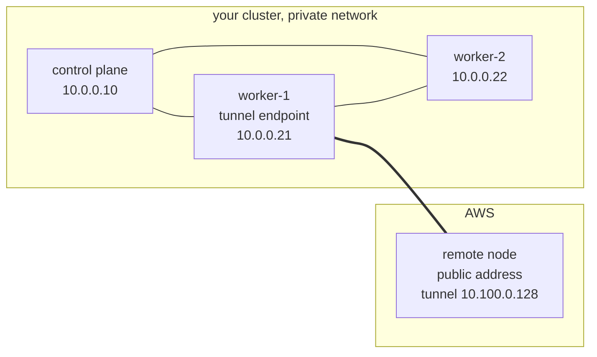
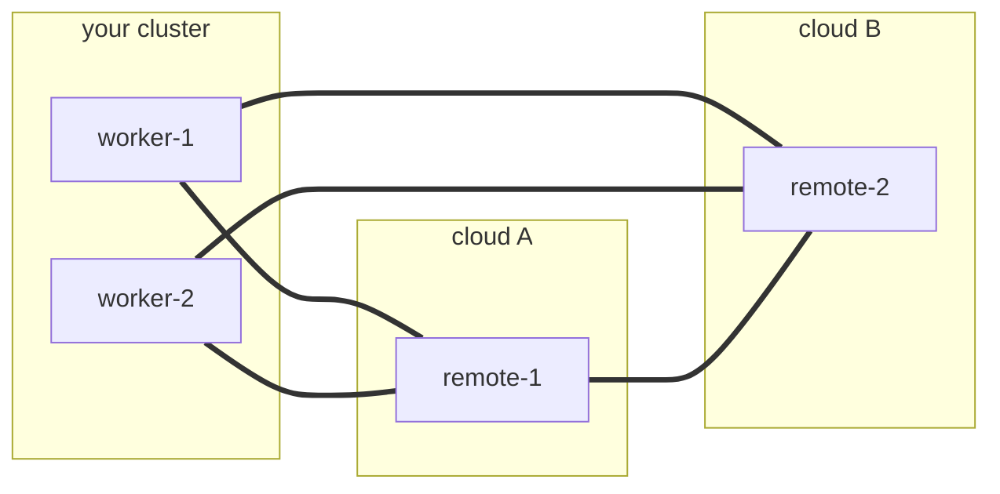
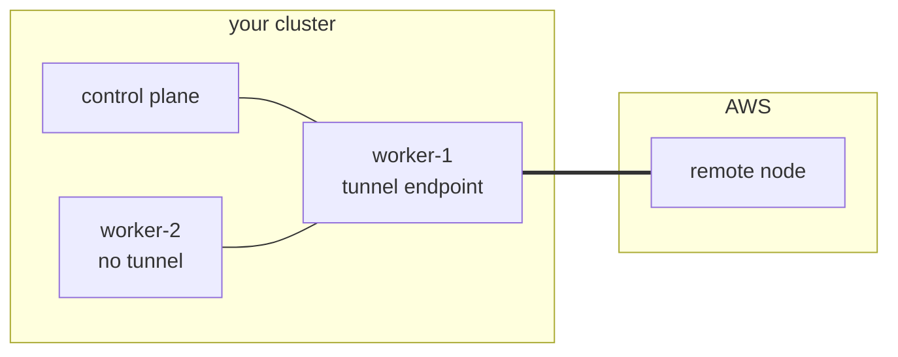

# cloud-provisioning

[](https://github.com/orgs/AppMana/packages?repo_name=cloud-provisioning)

Join a public cloud node to an on-premises, firewalled cluster over a
WireGuard tunnel, so the cluster can run internet-facing workloads such
as an ingress gateway on a node the internet can reach, while the
control plane stays private.

The node joins as an ordinary worker. It is labelled
cloud-provisioning.appmana.com/role=cloud-worker and tainted
cloud-provisioning.appmana.com/internet-facing:NoSchedule, so nothing
lands on it unless you say so. Pod networking is the cluster's own CNI
carried over the tunnel, with no second overlay.

## Deploying it

You need [Cluster API](https://cluster-api.sigs.k8s.io/user/quick-start),
core plus the infrastructure provider for your cloud, and
[cert-manager](https://cert-manager.io/docs/installation/), which
Cluster API requires. If the cluster has Windows nodes, set
deployment.nodeSelector on the Provider resources, because the upstream
manifests carry no OS selector of their own.

Install those and the chart once per cluster:

```bash
clusterctl init --infrastructure aws

helm install cloud-provisioning oci://ghcr.io/appmana/charts/cloud-provisioning \
  --namespace cloud-provisioning --create-namespace \
  --set tunnel.endpoints='kubernetes.io/hostname=worker-1'
```

Also once per cluster, apply the Cluster API objects that describe the
cluster and the cloud account. They are not part of this chart, which
owns only its own resources. A complete set is in
[examples/aws.yaml](examples/aws.yaml).

Then, for each node you want, a machine template and a claim naming it.
This pair is the only thing you repeat:

```yaml
apiVersion: infrastructure.cluster.x-k8s.io/v1beta2
kind: AWSMachineTemplate
metadata:
  name: public-worker
  namespace: cloud-provisioning
spec:
  template:
    spec:
      instanceType: t3.micro
      ami:
        id: ami-0123456789abcdef0
      subnet:
        id: subnet-0123456789abcdef0
      additionalSecurityGroups:
        - id: sg-0123456789abcdef0
      publicIP: true
---
apiVersion: cloud-provisioning.appmana.com/v1alpha1
kind: ProvisionedNodeClaim
metadata:
  name: public-worker
  namespace: cloud-provisioning
spec:
  infrastructureRef:
    apiGroup: infrastructure.cluster.x-k8s.io
    kind: AWSMachineTemplate
    name: public-worker
  clusterName: my-cluster
```

The template carries the whole machine, including the security group
admitting UDP 51820, so a provisioned node is reachable because its
template says it is, not because someone opened a port afterwards.

Watch it arrive, then schedule something onto it:

```bash
kubectl -n cloud-provisioning get provisionednodeclaim -w
kubectl get nodes -l cloud-provisioning.appmana.com/role=cloud-worker
```

```yaml
tolerations:
  - key: cloud-provisioning.appmana.com/internet-facing
    operator: Exists
    effect: NoSchedule
nodeSelector:
  cloud-provisioning.appmana.com/role: cloud-worker
```

Deleting the claim destroys the instance and removes the node:

```bash
kubectl -n cloud-provisioning delete provisionednodeclaim public-worker
```

Beyond tunnel.endpoints there is little to configure, and deliberately
so. The API server address comes from the endpoints of the kubernetes
service, and the pod addressing comes from the network's own per-node
records, re-read every pass, so there is no second copy of any of it to
drift.

tunnel.endpoints says which of your nodes terminate tunnels. It takes a
label selector, a set such as kubernetes.io/hostname in (worker-1,
worker-2), or the word all, and empty means all. Control planes are left
out unless the selector names them, so a tunnel cannot cost a control
plane its default route, and nodes this operator provisioned are never
included, since they are the far end of a tunnel rather than one of your
ends of it.

A set contains commas, and helm reads a comma in --set as the separator
between values, so a set based selector has to be escaped or the release
fails to install:

```bash
--set-string tunnel.endpoints='kubernetes.io/hostname in (worker-1\,worker-2)'
```

The remaining values matter only in specific cases. A remote node has
no image puller before it joins, so dialerBinary gives it a first-boot
binary by URL and digest; a URL without its digest is refused. If the
cluster's CNI configuration chains plugins a stock cloud image lacks,
such as bandwidth, cniPlugins supplies them the same way. There is an
optional Cluster API subchart, but a separate release is better,
because coupling the lifecycles lets a failed upgrade here delete the
provider namespaces.

## What happens

Suppose you run a k0s cluster on your own hardware, with Calico for
networking, and you want a worker in AWS. Your control planes have
private addresses and nothing on the internet can reach them. You
install the chart, selecting one worker to terminate tunnels, and
commit the two objects above.

The controller reads what it needs from the cluster: the API server
address, and which pod blocks belong to which node from Calico's own
records. The claim becomes a Cluster API Machine and an AWSMachine
built from your template, the kind taken from the template's kind with
the Template suffix removed. It generates a WireGuard identity for the
new node and renders its cloud-init: the peer list, the join token, and
a digest-pinned dialer binary.

AWS launches the instance. It boots, reads its own architecture,
fetches the matching binary, checks the digest, and brings up the
tunnel. Your worker dials out to it; the instance only listens, because
it is the side with a public address. It waits until the API server
answers through the tunnel and then runs k0s worker with its token,
which is the only path it has, so it cannot join any other way.

The node registers with the cloud-worker label and the internet-facing
taint. The controller tells Calico which address to peer on for it: its
tunnel address, since the instance's own address belongs to AWS and
means nothing to your cluster. It does the same in reverse for the node
holding the tunnel, pinning it to the address its own neighbours reach
it by, so bringing up a tunnel cannot cost a node the network it
already had. Calico then establishes a session across the tunnel and
distributes pod routes.

Your ingress gateway, tolerating the taint, schedules onto the new node
and serves the internet from an address the internet can reach. Your
control plane never leaves the private network.

## The tunnel

The tunnel carries reachability between nodes and nothing else. The
dialer installs host routes only, a /32 or a /128 per peer address, and
anything broader is refused when the peer list is parsed.

WireGuard's cryptokey accept list decides which key may encrypt a
packet. It is not a source of routes. Each peer is permitted its own
node's addresses and the pod blocks that node owns, and nothing else,
because the list is a trie with one owner per prefix: a range shared
between two peers belongs to whichever was written last, and traffic
for it follows whichever that happened to be. No service range is
permitted anywhere, since a service address is translated to a backing
pod on the sending node before anything is routed, so a packet crossing
the tunnel is already addressed to a pod or to a node.

Routing to pods stays the network's job, over the sessions those host
routes make possible.



The thick line is the tunnel. worker-1 dials out to the remote node,
which listens. Nothing dials inward to your network, and no other node
grows a tunnel interface.

Three rules follow from carrying only host routes. A peer's own
endpoint is never routed through the tunnel, because the encrypted
packet's outer destination would match that route and it would
encapsulate itself forever. Routes are pruned as well as added, so a
route that becomes wrong stops black-holing traffic. And a peer's
routes are installed only once it is reachable, meaning its endpoint is
known or a handshake has been seen, because a route to an unreachable
peer is a black hole.

More than one node can terminate tunnels, and more than one remote node
can join. Every selected node dials every remote node, and remote nodes
dial each other, since two nodes in different clouds share no private
network and have no other way to meet.



Each node holds one interface with one peer entry per counterpart, so
the mesh costs one interface per node rather than one per pair. The
interface is named from the identity of the peer list, so it is the
same on every member and never collides with a wg0 or a Tailscale
interface the node already has.

## Nodes that hold no tunnel

Most nodes hold no tunnel, and they still have to reach a remote node's
pods. They cannot manage it alone: a remote node is known by its tunnel
address, and a node with no tunnel has no route to that, so it cannot
even open a session to the remote to learn anything from it.

So a node that does hold a tunnel tells the others. It speaks BGP to
the rest of the site, on a port of its own because a network that
speaks BGP already has something on 179, and advertises the remote
nodes and their pod blocks with itself as the next hop. The site's own
router receives them like any other route, which leaves the choice
between two endpoints, and the withdrawal when a remote goes away,
where they belong.

Both are advertised, and the blocks are not redundant. A router will
not resolve one BGP route's next hop using another BGP route, since
that is how resolution loops form. The node address arrives that way,
so the blocks behind it would stay unreachable however well the address
underneath them is routed. Carrying the blocks too, with the endpoint
as the next hop, resolves them against a directly connected address and
asks nothing of recursion.



worker-2 sends to a remote pod by way of worker-1, which forwards it
into the tunnel. The tunnel carries traffic belonging to neither of the
two nodes holding it, in both directions, which is what makes this work
at all.

## Testing

Four harnesses live under `harness/`, and they are not
interchangeable. Each exists because the level below it could not
reproduce a specific class of failure, so the first question is always
which level the mechanism lives at.

| harness | runs on | proves | cost |
|---|---|---|---|
| `harness/netns-routing` | bare network namespaces, one host, no cluster | the dialer's own route and rule discipline against a real kernel | seconds |
| `harness/kind-e2e` | one kind cluster, no topology | what the controller derives from a claim: CAPI objects, rendered userdata, peer and adoption Secrets, both DaemonSets, the delete cascade | ~2 min |
| `harness/clab` | **kind node containers** under containerlab, four L2 segments | the distribution × network matrix: placement, outages, and the mechanism assertions | ~15 min/row |
| `harness/vm-single-nic` | **real VMs** under QEMU/KVM via vrnetlab | failures that need a genuine cold boot: real PID 1, real kubelet start ordering | ~30 min/run |
| `harness/e2e` | the same containerlab lab, driven from Go | the same rows as `harness/clab`, with typed results and its own tests; the rig is a seam, so a row can run on containers or machines | ~15 min/row |

The last two are the ones people confuse, because both use
containerlab and both talk about nodes. The difference is what a node
*is*: in `clab` a node is a `kindest/node` container reached with
`docker exec`; in `vm-single-nic` a node is an Ubuntu VM booted under
QEMU/KVM and reached over SSH. `vm-single-nic` exists because the
route-hijack bug is a boot-time race between kubelet resurrecting a
stale DaemonSet pod and anything else getting a chance to intervene,
and a container cannot reproduce that: there is no cold init to race
against. Its README carries the full reasoning.

### `harness/e2e`, and what a harness may not do

`harness/e2e` is the same lab driven from Go, and it is replacing
`harness/clab` row by row. The reason is not that shell is unpleasant.
It is that the shell harness could not be tested, so its own defects
were indistinguishable from the product's: it read verdicts by
grepping text files, and a stale copy of one was once reported as a
live result.

The line it draws is the important part. A harness may **be the
platform** — run machines, give them addresses and routes, hand them
the userdata a cloud would hand them, take them away — and it may
**measure**. It may not do the product's work, and it may not do a
dependency's work. Every time this rule was broken, a row passed for
the wrong reason:

- The shell harness rewrote the rendered `kubeadm join` with a string
  substitution, so no row ever ran the userdata as rendered. The
  accommodation is real, because a container cannot satisfy kubeadm's
  preflight against a kernel it does not own, but it belongs to the
  rig that needs it and it is now printed by the run.
- The shell harness patched `Machine.status.nodeRef`, which is Cluster
  API's to write. Removing that exposed two real defects in the
  product, described in the commit history.
- Cluster API and cert-manager were not installed at all, on the
  stated grounds that "the join path never talks to them". The join
  path does. They are installed now, and installing them for real
  exposed four conformance requirements this repository's own
  infrastructure provider had never met.

What the harness writes to the cluster is now three things, all of
them a cloud's: the infrastructure cluster's status, the
infrastructure machine's status, and a Node's `spec.providerID`, which
is what a cloud controller manager sets.

Nothing is verified by hand. If a run reports a failure and the only
way to tell whether it is real is a shell command, that is a defect in
the harness: it now reports how long a claim took against the window
it was given, and says when a run was cancelled rather than having
used that window up.

### Two rigs, and what only machines can find

`harness/e2e` reaches every node through one interface, so a row runs
unchanged on either rig and the two are comparable. What differs is
what a node *is*, and nothing else:

| | container rig | machine rig |
|---|---|---|
| a cluster node is | a `kindest/node` container | an Ubuntu guest under QEMU/KVM, wrapped by vrnetlab |
| reached by | `docker exec` | into the wrapper, then ssh to loopback behind qemu's NAT |
| kernel | this host's | its own |
| first boot | none | firmware, bootloader, kernel, init, cloud-init |
| userdata | the rig interprets `write_files`/`runcmd` itself | the guest's own cloud-init reads it; the harness interprets nothing |
| addressed by | the harness, after start | its platform, at boot, before any userdata runs |
| routers, edges, bastion | containers | containers — an appliance with no kubelet gains nothing from a kernel |

Containers stay the fast tier. Machines are the authoritative one, and
every assumption below was invisible until a node became one:

- **A machine had no name.** The launcher calls every guest `ubuntu`
  unless told otherwise, and etcd identifies members by hostname: the
  second control plane got an initial-cluster list holding its own
  name twice, could not tell which entry was itself, and started a
  cluster of its own. The kubelets would have collapsed five machines
  into one Node object the same way. A container takes its name from
  containerlab and never needed one.
- **Deadlines bounded nothing.** Every wait checked the clock between
  attempts, so a probe that never returned defeated the limit it sat
  inside. No probe had ever hung on containers; a wedged `k0s status`
  on a machine hangs indefinitely.
- **A reading was never a gate.** The node list was read once and
  printed, so a five-node site reported three and everything
  downstream measured the short list. Registration is fast enough on
  containers that the single read always caught them all.
- **Userdata was handed to a running node**, which is not a thing a
  platform does. A machine reads it once, at first boot, so giving one
  userdata means launching an instance with it — replaced, not
  restarted, because the guest's overlay disk is created only when
  none exists.
- **Addressing came after boot**, which is fine for a site node the
  harness configures later and far too late for a remote whose
  userdata dials the site the moment it runs. It is now in the
  platform's network configuration, which cloud-init applies before
  any userdata — and which is also what the reboot rows require.
- **Link restoration waited for the node it was unblocking.** A guest
  cannot finish booting without its interfaces, so waiting for it to
  answer before creating them is a deadlock; and the check asked the
  node about the topology's name for a link, which a machine's kernel
  never uses.

None of these were product defects. Each was the harness meeting a
real machine for the first time, which is the point of having the
tier.

Eventually they stopped being harness defects. The machine tier's
first two product findings were both in what a node does at its own
first boot, which is the one thing a container cannot reach:

- **A join assumed the cloud it was written for.** The k0s worker
  pattern asked EC2's instance-metadata service for the node's
  addresses with no timeout and no tolerance for failure. That
  service answers on a link-local address nothing routes, so off that
  cloud the request does not fail — it hangs for two minutes and then
  aborts the rest of the block. The dialer was installed and the
  tunnel was up, so the machine looked provisioned and had joined
  nothing. Any k0s remote outside AWS failed that way. k3s and rke2
  already handled it, which made it an inconsistency rather than a
  decision.
- **Nothing told the node which of its addresses was its own.** With
  the metadata lookup bounded, the node chose for itself and chose
  the out-of-band address every machine in the lab shares. It joined,
  went Ready, and carried an identity nothing was looking for, so it
  was never adopted. The address was never something to discover:
  this operator's own infrastructure provider reports it and builds
  the peer list from it. Rendering had to wait for it, too — userdata
  is read once, so a document written before the address arrives can
  never carry it, which is the same reason an empty peer list is
  waited out rather than baked.

### What the machine tier has proven

One full row, k0s with Calico, end to end on machines:

```
registered: [cp cp2 cp3 w1 w2]
every node Ready
the node ran the userdata the product rendered   (remote1, remote2)
the mesh published remote1's pod blocks: 10.244.159.0/26
the mesh published remote2's pod blocks: 10.244.133.0/26
checks: 140  passed: 140  failed: 0  converged after 2m47s
```

Both remotes were launched as new instances so that their own
cloud-init would read the document the product rendered, with nothing
in the harness interpreting it, and the isolation assertions hold
underneath the whole run.

The same row on the container rig agrees with it — same checks, same
published pod blocks — which is what licenses using containers as the
fast tier at all:

| rig | checks | converged | wall clock |
|---|---|---|---|
| container | 140/140 | 46s | ~11 min |
| machine | 140/140 | 2m47s | ~19 min |

And a power event, which is the row a container cannot honestly run:

```
### PASS remote1-reboot (victim=remote1, mode=reboot)
    checks: 140  passed: 140  failed: 0  converged after 56s
    checks: 102  passed: 102  failed: 0  converged after 1m42s
    checks: 140  passed: 140  failed: 0  converged after 1m26s
```

The machine lost power and came back through firmware, a bootloader, a
kernel and an init, rebuilding its own tunnel from its cached peer
list while the cluster was on the far side of the tunnel it was
raising. The rest of the lab kept carrying traffic while it was gone.


### The accommodation the machine tier closed

The container rig cannot run `kubeadm join` as the product renders
it. kubeadm's preflight inspects the kernel it runs on, which in a
container is this host's, so the rig rewrites the command with
`--ignore-preflight-errors=all` and **reports that it did** — the
shell harness made the same substitution silently, so every kubeadm
row ran a command the product had not rendered and no reader could
tell.

On machines there is no such mechanism: cloud-init runs the document
as written. The kubeadm site builds there with all five nodes
registered and preflight passing, which settles what the
accommodation was: a real container limitation, not a product problem
being papered over. It also means every kubeadm row on containers is
running a weaker check than it appears to, and the machine tier is
where that claim is actually tested.

kubeadm is also the one distribution that does not bring its own
runtime, so the machine rig builds the node first — containerd, runc,
CNI plugins, a kubelet and its supervisor, pinned to the version
`kindest/node` ships. Its *remotes* still need a baked node image,
because a remote is launched from the base image and its join pattern
runs kubeadm directly, which is what a kubeadm deployment assumes an
AMI to have provided.

### The matrix harness (`harness/clab`)

Four separate L2 segments, never one bridge pretending to be four: the
site LAN (`10.10.0/24`), a transit segment standing in for the
internet (`198.51.100/24`), and two clouds (`203.0.113/24`,
`192.0.2/24`) that can reach each other only across it. Nodes run with
`network-mode: none`, so containerlab's management network cannot
quietly join the site and both clouds on one L2 and make the isolation
imaginary. A node has the interfaces its segments give it and nothing
else; the harness drives it with `docker exec`, which needs no address
at all.

Seven cluster nodes (three control planes, two site workers behind a
NAT router, two remotes in separate clouds), plus routers, cloud edges
and a bastion. This host cannot reach the API server and should not be
able to, so everything that talks to the cluster goes through the
bastion.

Stages, in the order a row runs them:

| stage | what it does |
|---|---|
| `up.sh` | builds the topology and **proves the four segments isolate** before anything is installed |
| `cluster.sh` → `cluster.d/<distro>.sh` | builds the site cluster with that distribution's own tooling |
| `install.sh` → `cni.d/<cni>.sh` | installs the network, then the product: images carried in from this host, because the site has no route to a registry |
| `claim.sh` | applies a claim the way an operator would, and fills in only what an infrastructure controller would have reported |
| `bootstrap.sh` | applies the rendered userdata to the remote |
| `matrix.sh` | placement rows from `scenarios.tsv` |
| `outage.sh` | outage rows from `outages.tsv` |
| `mechanism.sh` | asserts the network the controller models, and who balances the API path |

`distro-matrix.sh` is the outer loop over `distros.tsv` (13 rows,
distribution × network). A distribution change rebuilds the cluster,
so it is a loop *around* the matrices rather than a column inside
them; placement rows deliberately never rebuild the topology, because
what they differ in is placement.

### What a check actually measures

`harness/health-check.sh` puts one pod on each node and then walks
**every ordered pair** — by pod address and by service address — plus
a 1 MiB transfer per pair, cluster DNS from each node, and the path
off the cluster. That is 120 checks on the six-node rows and 161 on
the seven-node ones.

Two details that are load-bearing:

- **`kubectl exec` cannot be used on a remote.** It reaches a pod by
  way of its node's kubelet, which the API server connects to
  directly, and a node joined over a tunnel has no return path for
  that. Using it would report the tunnel as broken when it is the exec
  path that is absent. `HEALTH_CHECK_EXEC=node` runs the probe through
  the node's own container runtime instead; the traffic under test is
  unchanged.
- **The transfer check exists because every other check fits in one
  small packet.** A path whose largest packet cannot cross looks
  perfectly healthy to a ping-sized probe, which is exactly the
  failure an encapsulating network stacking its header inside the
  tunnel's would produce.

Outage rows make three claims in sequence: the matrix is green before
anything breaks (a failure measured on a broken baseline names the
wrong culprit), the survivors converge among themselves while the
victim is down, and the victim's return brings everything back with
nothing reinstalled or forgiven. `link` rows pull the cable and leave
the machine running; `reboot` rows SIGKILL it and give it back only
what a platform provides — a NIC, an address, a gateway.

### Discipline the harness enforces

- **Zero rows is a failure, not a pass.** An assertion that found
  nothing to assert on proved nothing.
- **One lock** (`/tmp/cldt-matrix.lock`) serialises every run; kill by
  explicit PID from `fuser`, never by pattern.
- **Stage deadlines**, so a wedged join fails the row instead of
  holding the lab overnight.
- **Read verdicts from live files**, never from a row copy that may
  predate the run you are watching.

### What this harness cannot prove

Being explicit, because the container rig is faithful in ways that
invite over-trust. The kernel is real: WireGuard, netfilter, ip rules,
routing tables, cryptokey routing and reverse-path filtering are all
exercised per network namespace against the host's actual kernel, and
every defect the matrix has found was a genuine kernel-datapath bug
rather than a container artifact.

What it cannot reach:

- **First-boot userdata.** `bootstrap.sh` parses the rendered
  cloud-config and interprets `write_files` and `runcmd` itself. Real
  cloud-init never runs, so the templates are constrained to those two
  keys on purpose — and nothing beyond them is proven.
- **Per-node kernels.** Every node shares this host's kernel.
  `br_netfilter` already showed the seam: the module had to be loaded
  on the host and its values pinned globally, which on real machines
  would be a node-local concern.
- **Bootloader and initramfs.** They do not exist here — which is
  precisely where OpenShift's ignition runs.
- **Immutable operating systems.** RHCOS, SCOS and Talos cannot be
  containers at all.

Those four gaps are the case for the VM tier, and they are why
`vm-single-nic` exists at the level it does.

## Compatibility

What each distribution has passed on the containerlab harness: a
seven-node HA lab (three control planes, two site workers behind a
NAT router, two remotes in separate clouds meeting only across a
modelled internet), the site built by `harness/clab/cluster.d/`, the
remotes joined through this operator's own provider for that
distribution.

Two axes, because both change what the mesh must do: the
distribution decides how a remote joins and who balances its API
path, and the container network decides whether the tunnel carries
pod addresses or node addresses.

| | kubeadm | k0s | k3s | RKE2 |
|---|---|---|---|---|
| native join through the provider | bootstrap token + CA pin | bootstrap token in a kubeconfig, gzip+base64 | `K10<CA-hash>::<id>.<secret>`, minted via the API | same, supervisor on 9345 |
| who balances the API path | **wg-apiproxy** (ours) | nllb (envoy, `[::1]:7443`) | agent balancer (`127.0.0.1:6444`) | agent balancer (`127.0.0.1:6443`) |
| calico (native) | pass | pass, full 6×9 | pass | pass |
| kube-router (native) | pass | pass (built-in) | — | — |
| flannel (encapsulated) | pass | — | pass (embedded) | pass (canal, built-in) |
| cilium (encapsulated) | pass | pass | pass | pass |
| outage: `cp-dies` (link) | pass | pass | pass | **excluded: RKE2 limitation** |
| outage: `reboot-remote`, `reboot-cp` | pass | pass | pass | pass |
| mechanism assertions | pass | pass | pass | pass |

Thirteen combinations, each rebuilt from an empty topology and joined
through the product's own provider. A dash is a combination not run
rather than one that failed: each distribution carries its own
network as a row (`default`), and the ones not listed add no
mechanism the other cells do not already cover.

What a row measures: every ordered pair of nodes by pod address, the
same by service address, a 1 MiB transfer per pair, cluster DNS from
each node, and the path off the cluster from each node. That is 120
checks on the six-node rows and 161 on the seven-node ones. The
transfer check exists because every other check fits in a single
small packet and so cannot see a path whose largest packet does not
cross, which an encapsulating network stacking its own header inside
the tunnel's is the obvious way to produce.

All thirteen rows come from one campaign against one build, each row
rebuilt from an empty topology with every check enabled: thirteen
passed, none failed. Earlier campaigns are not folded in, because
they ran against trees that still carried defects these rows found.

The rows, and what each one claims:

- **Placement rows** (`harness/clab/scenarios.tsv`) vary which site
  nodes hold tunnels, from one control plane to every node, against
  one or two clouds. Each row measures every pair of nodes in both
  directions, by pod address and by service address, by a transfer far
  larger than any packet the path can carry, plus cluster DNS and the
  path off the cluster. The `all-nodes-two-clouds` row is the
  superset, so a combination that passes it has proven the mesh does
  not care what built the cluster or what carries its pods.
- **Outage rows** (`harness/clab/outages.tsv`) make three claims in
  sequence: the full matrix is green before anything breaks, the
  survivors converge to green among themselves while the victim is
  down, and the victim's return brings the whole lab back to green
  with nothing reinstalled or forgiven. `link` rows pull the cable and
  leave the machine running; `reboot` rows SIGKILL the machine and
  give it back only what a platform provides (a NIC, an address, a
  gateway), so everything else must be rebuilt by what the node runs
  at boot. `reboot-remote` is the core invariant made executable: the
  host unit raises the tunnel from its cached peer list while the
  cluster is unreachable, because the tunnel must never depend on the
  Kubernetes it carries.
- **Mechanism assertions** (`harness/clab/mechanism.sh`) verify the
  who-balances table on the live remotes: kubeadm's wg-apiproxy
  answering on the loopback with kubelet dialing it and surviving the
  dialer's death; k0s's nllb envoy; the k3s/RKE2 agent balancer's
  state file holding all three control planes. They also compare the
  network the controller says it is modeling against the one the row
  installed, encapsulation included: a mesh that models the wrong
  network publishes the wrong prefixes while every component reports
  healthy, which is how kube-router stayed broken for two full rows.
  "Full" versus the shorter suite is scope, not doubt: k0s-calico (the
  production pairing) ran all six placement rows and all nine outage
  rows; the rest run the superset placement row plus the outage rows
  whose mechanics differ.

**The RKE2 exclusion** is RKE2's own recovery story, measured and
recorded rather than papered over (`harness/clab/distros.tsv` carries
the full mechanism): a sustained partition of an RKE2 server node
wedges that node's etcd beyond the distribution's unaided recovery.
rke2-server fatals on lost leader election (by design, expecting a
clean restart), its containerd dies with it while the pod shims
survive, and the orphaned etcd keeps heartbeating raft while its
serving paths block on a log pipe nobody reads anymore; every restart
then dies at the datastore reconcile, even after the partition heals.
Killing the orphaned etcd by hand recovers the node in about three
minutes. Known upstream (rancher/rke2#4510, #4479, #7155). k3s embeds
etcd in-process, restarts it with itself, and passes the identical
row. The mesh stayed green throughout: no tunnel was on the affected
node.

Talos is excluded from the matrix by design decision, not omission:
it runs no foreign binaries and has no systemd, and this tunnel is
host-configured precisely so it cannot depend on the Kubernetes it
carries. Supporting Talos means WireGuard in the machine config or a
system extension, a different product surface tracked in
`join-patterns/README.md`.

## Layout

```
controller/               endpoint-controller (claim, join and mesh) and the dialer
controller/pkg/join/      one package per specialization: k0s and kubeadm for
                          joining, aws and docker for fulfillment
controller/pkg/discover/  reads the cluster's own API addresses
controller/pkg/cni/       recognises the network and reads each node's pod blocks
controller/pkg/tunnel/    the wire contract shared by every producer and consumer
join-patterns/            cloud-init templates, one per join mechanism
charts/                   the Helm chart
examples/                 a complete set of manifests
harness/health-check.sh   every pair of nodes, by pod address and by service address
harness/netns-routing/    single-NIC routing end to end for the dialer
harness/kind-e2e/         one claim becomes a real joined node over a real tunnel
harness/vm-single-nic/    real VM, real boot and reboot
```
