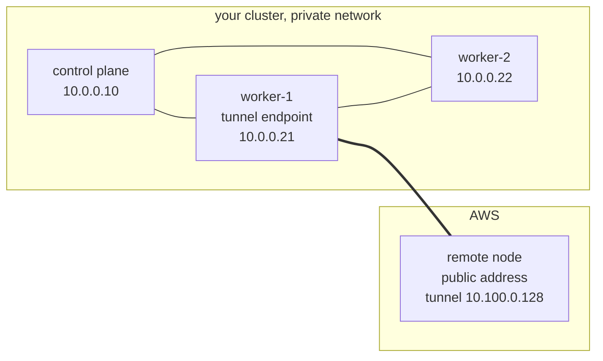
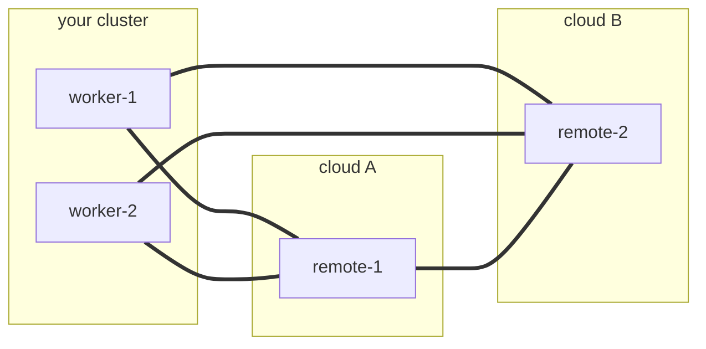
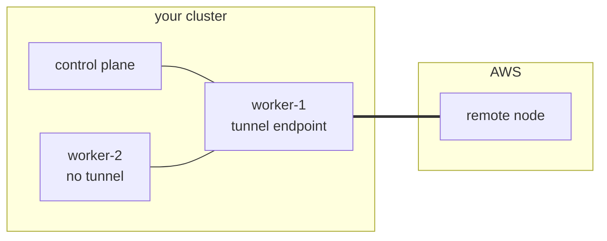

# cloud-provisioning

[](https://github.com/orgs/AppMana/packages?repo_name=cloud-provisioning)

Join a public cloud node to an on-premises, firewalled cluster over a
WireGuard tunnel, so the cluster can run internet-facing workloads such
as an ingress gateway on a node the internet can reach while the
control plane stays private.

You describe the machine with an ordinary
[Cluster API](https://cluster-api.sigs.k8s.io/) machine template, then
commit one claim naming it:

```yaml
apiVersion: infrastructure.cluster.x-k8s.io/v1beta2
kind: AWSMachineTemplate
metadata:
  name: public-worker
  namespace: cloud-provisioning
spec:
  template:
    spec:
      instanceType: t3.micro
      ami:
        id: ami-0123456789abcdef0
      subnet:
        id: subnet-0123456789abcdef0
      additionalSecurityGroups:
        - id: sg-0123456789abcdef0
      publicIP: true
---
apiVersion: cloud-provisioning.appmana.com/v1alpha1
kind: ProvisionedNodeClaim
metadata:
  name: public-worker
  namespace: cloud-provisioning
spec:
  infrastructureRef:
    apiGroup: infrastructure.cluster.x-k8s.io
    kind: AWSMachineTemplate
    name: public-worker
  clusterName: my-cluster
```

The template carries the whole machine, including the security group
admitting UDP 51820, so a provisioned node is reachable because its
template says so. `kubectl delete provisionednodeclaim public-worker`
destroys the instance and removes the node.

The node joins as a normal worker, labelled
`cloud-provisioning.appmana.com/role=cloud-worker` and tainted
`cloud-provisioning.appmana.com/internet-facing:NoSchedule`. Pod
networking is the cluster's own CNI carried over the tunnel, with no
overlay of its own.

A complete example, including the Cluster API objects to apply once per
cluster, is in [examples/aws.yaml](examples/aws.yaml).

## Install

```bash
helm install cloud-provisioning oci://ghcr.io/appmana/charts/cloud-provisioning \
  --namespace cloud-provisioning --create-namespace \
  --set tunnel.endpoints=kubernetes.io/hostname=worker-1
```

Nothing else is required, and there is deliberately nothing else to
set. The API server address comes from the endpoints of the
`kubernetes` service, and the pod addressing comes from the network's
own records, per node, re-read every pass. None of it is configuration
you maintain, and none of it can drift, because there is no second
copy of it to disagree.

Or from a checkout: `helm install cloud-provisioning ./charts/cloud-provisioning -f values.yaml`
(run `helm dependency update ./charts/cloud-provisioning` first if you
enable the Cluster API subchart).

Values worth knowing:

| Value | Why |
|---|---|
| `tunnel.endpoints` | Which of your nodes terminate tunnels. A label selector (`kubernetes.io/hostname=worker-1`), a set (`kubernetes.io/hostname in (worker-1,worker-2)`), or the word `all`. Empty means the same as `all`. Control planes are excluded unless the selector names them; nodes this operator provisioned are never included, since they are the far end of a tunnel rather than one of your ends of it. |
| `dialerBinary.<arch>.url` / `.sha256` | First-boot binary for the remote node, which has no image puller before it joins. A URL without its digest is refused. |
| `cniPlugins.<arch>.url` / `.sha256` | Needed when the cluster's CNI configuration chains plugins a stock cloud image lacks, such as `bandwidth`. |
| `cluster-api-operator.enabled` | Optional subchart. A separate release is preferable: coupling the lifecycles lets a failed upgrade here delete the provider namespaces. |

## Prerequisites

- [Cluster API](https://cluster-api.sigs.k8s.io/user/quick-start),
  core plus an infrastructure provider.
- [cert-manager](https://cert-manager.io/docs/installation/), which
  Cluster API requires.

Cluster API's own controllers need `deployment.nodeSelector` on the
Provider resources if the cluster has Windows nodes, since the upstream
manifests carry no OS selector.

## Deploying it

Once per cluster, install Cluster API and the provider for the cloud
you are using, then the chart:

```bash
clusterctl init --infrastructure aws

helm install cloud-provisioning oci://ghcr.io/appmana/charts/cloud-provisioning \
  --namespace cloud-provisioning --create-namespace \
  --set tunnel.endpoints='kubernetes.io/hostname=worker-1'
```

Also once per cluster, apply the objects that describe the cluster and
the cloud account to use. These are ordinary Cluster API objects and
are not part of this chart, which owns only its own resources:

```bash
kubectl apply -f examples/aws.yaml
```

Then, for each node you want, a machine template and a claim naming
it. This is the only pair you repeat:

```bash
kubectl apply -f - <<'EOF'
apiVersion: infrastructure.cluster.x-k8s.io/v1beta2
kind: AWSMachineTemplate
metadata:
  name: public-worker
  namespace: cloud-provisioning
spec:
  template:
    spec:
      instanceType: t3.micro
      ami: {id: ami-0123456789abcdef0}
      subnet: {id: subnet-0123456789abcdef0}
      additionalSecurityGroups: [{id: sg-0123456789abcdef0}]
      publicIP: true
---
apiVersion: cloud-provisioning.appmana.com/v1alpha1
kind: ProvisionedNodeClaim
metadata:
  name: public-worker
  namespace: cloud-provisioning
spec:
  infrastructureRef:
    apiGroup: infrastructure.cluster.x-k8s.io
    kind: AWSMachineTemplate
    name: public-worker
  clusterName: my-cluster
EOF
```

Watch it arrive:

```bash
kubectl -n cloud-provisioning get provisionednodeclaim -w
kubectl get nodes -l cloud-provisioning.appmana.com/role=cloud-worker
```

Then put something on it. The node carries a taint, so only a workload
that tolerates it will schedule there:

```yaml
tolerations:
  - key: cloud-provisioning.appmana.com/internet-facing
    operator: Exists
    effect: NoSchedule
nodeSelector:
  cloud-provisioning.appmana.com/role: cloud-worker
```

To remove it, delete the claim. The instance and the node object go
with it:

```bash
kubectl -n cloud-provisioning delete provisionednodeclaim public-worker
```

## A worked example

Suppose you run a k0s cluster on your own hardware, with Calico for
networking, and you want a worker in AWS. Your control planes have
private addresses and nothing from the internet can reach them.

You install the chart, selecting one of your workers to terminate
tunnels. Then you commit the two objects above and watch:

1. The controller reads what it needs from the cluster: the API server
   address from the endpoints of the `kubernetes` service, and which
   pod blocks belong to which node from Calico's own block records,
   re-read every pass rather than sampled once. None of it is
   configuration you maintain.
2. The claim becomes a Cluster API `Machine` and an `AWSMachine` built
   from your template. The kind comes from the template's kind with the
   `Template` suffix removed.
3. The controller generates a WireGuard identity for the new node and
   renders its cloud-init: the peer list, the join token, and a
   digest-pinned dialer binary.
4. The AWS provider launches the instance. It boots, reads its own
   architecture, fetches the matching binary, checks the digest, and
   brings up the tunnel. Your selected worker dials out to it; the
   instance only listens, because it is the side with a public address.
5. The instance waits until the API server answers through the tunnel,
   then runs `k0s worker` with its token. This is the only path it has,
   so it cannot join any other way.
6. The node registers, carrying the cloud-worker label and the
   internet-facing taint so ordinary workloads stay off it.
7. The controller tells Calico which address to peer on for that node:
   its tunnel address. The instance's own address belongs to AWS and
   means nothing to your cluster, and the tunnel address is the one
   every tunnel endpoint can reach. It does the same in reverse for
   the node holding the tunnel, pinning it to the address its own
   neighbours reach it by, so that bringing up a tunnel cannot cost a
   node the network it already had.
8. Calico establishes a session across the tunnel and distributes pod
   routes. Pods on the new node reach pods and services at home, and
   the reverse, over the ordinary CNI.

Your ingress gateway, tolerating the internet-facing taint, schedules
onto the new node and serves the internet from an address the internet
can reach. Your control plane never leaves the private network.

## The tunnel

The tunnel carries reachability between nodes and nothing else. The
dialer installs host routes only, `/32` or `/128`, to the addresses of
peer nodes. Anything broader is refused when the peer list is parsed.

WireGuard's cryptokey accept list decides which key may encrypt a
packet, and is not a source of routes. Each peer is permitted its own
node's addresses and the pod blocks that node owns, read from the
network's records, and nothing else. The list is a trie with one owner
per prefix, so a range shared between two peers would belong to
whichever was written last, and traffic for it would follow whichever
that happened to be.

No service range is permitted anywhere. A service address is
translated to a backing pod on the sending node, before anything is
routed, so a packet crossing the tunnel is already addressed to a pod
or to a node.

Routing to pods stays the network's job, over the sessions those host
routes make possible.



The thick line is the WireGuard tunnel. `worker-1` dials out to the
remote node, which has a public address and listens. Nothing dials
inward to your network, and no other node grows a tunnel interface.

Three rules follow from carrying only host routes:

- A peer's own endpoint is never routed through the tunnel. The
  encrypted packet's outer destination would match that route and it
  would encapsulate itself indefinitely.
- Routes are pruned as well as added, so a route that becomes wrong
  stops black-holing traffic.
- A peer's routes are installed only once it is reachable, meaning its
  endpoint is known or a handshake has been seen. A route to an
  unreachable peer is a black hole.

## A mesh of tunnels

More than one node can terminate tunnels, and more than one remote node
can join. Every selected node dials every remote node, and remote nodes
dial each other, because two nodes in different clouds share no private
network and cannot reach each other any other way.



Each node holds one WireGuard interface with one peer entry per
counterpart, so the mesh costs one interface per node rather than one
per pair. The interface is named from the identity of the peer list, so
it is the same on every member and never collides with a `wg0` or a
Tailscale interface the node already has.

Which of your nodes take part is the `tunnel.endpoints` selector. An
empty selector means every Linux worker; control planes are left out
unless you name them, so a tunnel cannot cost a control plane its
default route.

## Nodes that hold no tunnel

Only the nodes you select grow a tunnel interface, and the rest still
have to reach a remote node's pods. They cannot do it by themselves: a
remote node is known by its tunnel address, and a node with no tunnel
has no route to that, so it cannot even open a session to the remote
to learn anything from it.

So a node that does hold a tunnel tells the others. It speaks BGP to
the rest of the site, on a port of its own because a network that
speaks BGP already has something on 179, and advertises the remote
nodes and their pod blocks with itself as the next hop. The site's own
router receives them like any other route, which leaves the choice
between two endpoints, and the withdrawal when a remote goes away,
where they belong.

Both are advertised, and the blocks are not redundant. A router will
not resolve one BGP route's next hop using another BGP route, since
that is how resolution loops form. The node address arrives that way,
so the blocks behind it would stay unreachable no matter that the
address underneath them is now routed. Carrying the blocks as well,
with the endpoint as the next hop, resolves them against a directly
connected address and asks nothing of recursion.



`worker-2` sends to a remote pod by way of `worker-1`, which forwards
it into the tunnel. The tunnel accepts traffic that belongs to neither
of the two nodes holding it, in both directions, which is what makes
this work at all.

## Layout

```
controller/               endpoint-controller (claim, join and mesh) and the dialer
controller/pkg/join/      one package per specialization: k0s and kubeadm for
                          joining, aws and docker for fulfillment
controller/pkg/discover/  reads the cluster's own API addresses
controller/pkg/cni/       recognises the network and reads each node's pod blocks
controller/pkg/tunnel/    the wire contract shared by every producer and consumer
join-patterns/            cloud-init templates, one per join mechanism
charts/                   the Helm chart
examples/                 a complete set of manifests
harness/health-check.sh   every pair of nodes, by pod address and by service address
harness/netns-routing/    single-NIC routing end to end for the dialer
harness/kind-e2e/         one claim becomes a real joined node over a real tunnel
harness/kind-e2e/scenarios.tsv  where the tunnels land, one row per configuration
harness/vm-single-nic/    real VM, real boot and reboot
```
