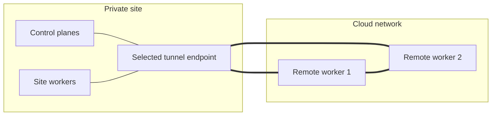
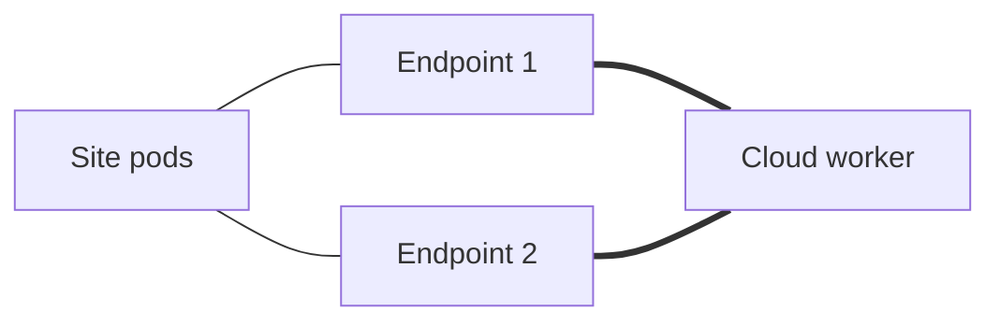
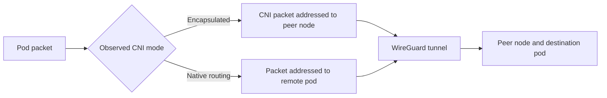
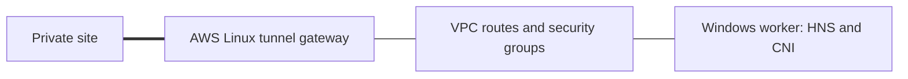
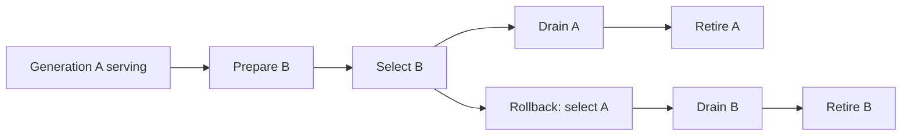

# Tunnel scenarios and validation

Kubernetes guests use one physical Ethernet NIC. WireGuard devices are virtual
interfaces. Local VM management uses QEMU Guest Agent over virtio-serial; AWS
management uses SSM where the instance profile and image provide it. CAPI itself
does not supply a universal out-of-band management channel.

## One site endpoint and cloud workers

The site endpoint initiates WireGuard traffic toward each cloud worker's public
listener. Site nodes reach remote pods through that endpoint. Cloud workers also
peer with one another, allowing remote-to-remote traffic across cloud networks.

Recorded tests:

- [k0s/Calico CAPA AWS](validation/aws-k0s-calico-results.json): add, remove, and
  recreate workers, then verify converged connectivity under four placements.
- [MicroK8s local VM lifecycle](validation/microk8s-lifecycle-results.json): two
  replacement cycles and four placements, with 1,324 required checks.
- The cloud-to-cloud edge above represents remote peering. Multi-provider AWS,
  Azure, and Google Cloud qualification requires separate assets and campaigns.

## Multiple site endpoints and outages

Selecting two endpoints gives the site more than one tunnel path. Route selection
and withdrawal follow the deployed CNI and the product's site-routing integration.

The [k0s/Kube-router outage campaign](validation/k0s-1.36-kuberouter-outage-results.json)
checks twelve NIC-cut/reboot rows under one-worker and two-worker placements.
It records 4,904 required checks at convergence. Sole-endpoint isolation has
explicit expected failures for site-dependent traffic. Recovery checks and
continuous packet-loss measurements are reported separately.

## CNI encapsulation and native routing

For encapsulated profiles, a pod packet enters its CNI tunnel first; WireGuard
carries the resulting node-to-node packet across the site/cloud boundary.
Native routing profiles carry pod addresses directly and authorize the owning
node's pod prefixes in WireGuard.

- [k0s/Calico](validation/k0s-1.36-lifecycle-results.json) and
  [MicroK8s/Calico](validation/microk8s-lifecycle-results.json) exercise their
  observed distribution configurations.
- [Kube-router](validation/k0s-1.36-kuberouter-lifecycle-results.json) exercises
  its routed profile and endpoint placement changes.
- Flannel and Canal results retain their original versions in the
  [VM campaign documentation](validation/single-nic-vms.md).
- BGP belongs to profiles that use it. The controller reads the CNI's encapsulation
  mode and per-node allocations instead of assuming every network uses BGP.

## Windows through an AWS gateway attachment

A gateway attachment can route traffic between Windows worker interfaces and the
site through an AWS Linux gateway. Its lifecycle owns route-table entries,
security-group ingress, forwarding configuration, and CNI transport publication.

[Gateway ingress evidence](validation/gateway-api-ingress-results.json) covers
native Windows Server 2022 API access diagnosis and withdrawal cleanup.
[Windows gateway documentation](windows-gateway.md) describes setup and current
limits. This partial evidence leaves full packet, lifecycle, and failure
qualification open.

## Generation switch, rollback, and retirement

Generation handover prepares a second set of WireGuard keys and devices, switches
the selected path, drains the former generation, and retires it. Rollback restores
the former path before draining the abandoned generation.

[Linux VM experiments](validation/handover-egress-results.json) exercise IPv4/IPv6
switch, rollback, retirement, and source isolation. The
[Windows Server 2022/2025 experiment](validation/windows-stable-owner-isolation-results.json)
keeps the host identity on a separate owner interface while selecting generation
devices. Its IPv4/IPv6 runs record 8,803 authorized exchanges, 40 rejected source
probes, and 1,483 positive alternate-source controls. Windows test packets use an
opaque UDP relay because existing production routes constrain direct endpoints.

These are host-level experiments. Production CNI/HNS policy and controller-driven
handover require separate integration. The
[MicroK8s production-path result](validation/microk8s-source-routing-results.json)
retains packet loss. See [handover design](tunnel-handover.md) for persisted receipt
rounds, drain policy, and remaining acceptance gates.
