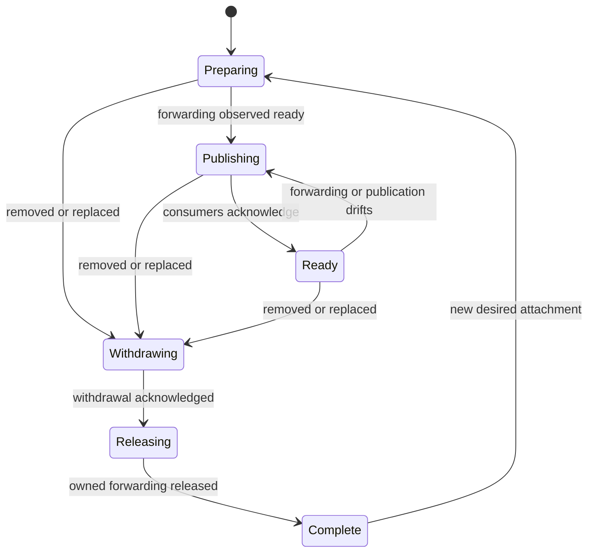

# Windows gateway integration design

The opt-in AWS controller reconciles Windows gateway attachments with durable
resource leases and consumer acknowledgements. Both Windows Server 2022 and 2025
have reached Ready and passed cross-node pod, Service and DNS smoke checks.
Large-transfer MTU handling, self-Service hairpin access and lifecycle qualification
remain incomplete. This is an experimental configuration, not a production support claim.

Windows HNS needs an Ethernet adapter for the tested native Calico VXLAN
network. The Windows WireGuard adapter carries host IP traffic but cannot host
that HNS network. A Linux gateway in the worker subnet can terminate WireGuard
and forward encapsulated traffic onto Ethernet. Windows retains its native
distribution CNI and physical NIC address.

## Planning implementation

The provider-independent [attachment package](../controller/pkg/attachment/plan.go)
validates CAPI Machine UID, Node UID, provider identity, network-interface identity,
network and subnet membership. It renders host return routes separately from
the worker's native transport address and rejects routes overlapping the cloud
subnet or observed WireGuard underlay endpoints. The current forwarding
capability is IPv4 UDP transport within a shared subnet.

[Peer projection](../controller/pkg/attachment/peers.go) adds the worker's native
host prefix to the gateway peer for site consumers. For the attached worker it
removes CNI transport destinations from kernel-route requests, including legacy
single-host and elected transit routes, while preserving WireGuard AllowedIPs.
It refuses an absent or duplicate gateway key and conflicting ownership of the
worker address. Projection operates on copies and is idempotent.

Render a proposed plan from a public topology snapshot with the harness command:

```sh
cd harness/e2e
go run ./cmd/gatewayplan < observed-topology.json > proposed-attachment.json
```

The input contains `request` (a `GatewayRequest`), `gatewayKey`, `sitePeers` and
`workerPeers`. The two peer lists are the current renders for their respective
consumers. The output contains the validated plan and both projected lists.
The command performs no cloud or Kubernetes mutations and does not establish
readiness. Provider adapters must revalidate instance and interface identities
before applying it; a snapshot is not a lease on those resources.

[Live planning evidence](validation/gateway-plan-results.json) covers current
CAPI/Node/EC2 associations for both Windows builds. Unit tests cover the
observed two-source packet path, loop prevention, conflicting prefix ownership,
idempotence and input preservation. This evidence is narrower than an applied
network or a successful lifecycle test.

## Lifecycle implementation

The [attachment reconciler](../controller/pkg/attachment/reconcile.go) composes
three capabilities: persistent intent storage, infrastructure forwarding and
consumer publication. Each step advances one recorded boundary:



Provider preparation starts only after intent is saved. A failed persistence
write after a provider operation causes a retry of the same lease. Replacement
retains the original plan throughout withdrawal and release. It prepares the
replacement afterward; uninterrupted gateway failover remains a separate gate.
Every new attachment attempt gets a fresh persisted lease identity, including
reattachment after the intent object was deleted.

The [ConfigMap store](../controller/pkg/attachment/store.go) uses object UID and
resourceVersion preconditions. Its finalizer retains active intent through a
deletion request. Reconciliation uses the stored plan for cleanup even if the
new desired input is invalid, and removes the finalizer only after release.
Controllers must serialize reconciliation per attachment and retain the durable
intent when reporting errors. A phase alone cannot replace provider read-back
or exact consumer acknowledgement.

[Lifecycle contract validation](validation/gateway-lifecycle-contract-results.json)
covers interrupted persistence, repeated preparation, withdrawal ordering,
replacement identities and drift after readiness. Dedicated API/etcd processes
verify real Kubernetes update conflicts and finalizer behavior. The forwarding
and publication implementations in these tests are controlled test doubles;
this is not evidence of AWS route reconciliation, VM removal or gateway failover.

The [EC2 SDK transport](../controller/pkg/attachment/aws/transport.go) implements
nine attachment operations without an AWS CLI dependency. The caller supplies an
explicit region and credential provider; credentials never enter resource journals.
Use refreshable role credentials when wiring the runtime, following the
[AWS SDK credential configuration](https://docs.aws.amazon.com/sdk-for-go/v2/developer-guide/configure-gosdk.html).
The transport preserves the harness JSON observation contract, including ENI
`TagSet`, source/destination check booleans, ownership tags and pagination tokens.
SDK protocol tests cover signed requests and service errors. This transport is
available through opt-in runtime registration. The managed two-worker validation below exercises the registered worker with
real AWS attachment requests.

The [SSM guest reader](../controller/pkg/attachment/aws/ssm_guest.go) implements
Machine-bound HNS and Linux forwarding observations. It checks CAPI, Node and
single-NIC EC2 identities before dispatch and after completion. Polling tolerates
SSM's eventual consistency without resending a command, uses bounded timeouts,
and rejects failed, mismatched or potentially truncated results. See the
[AWS invocation semantics](https://docs.aws.amazon.com/systems-manager/latest/APIReference/API_GetCommandInvocation.html).
[Native SDK validation](validation/windows-sdk-ssm-results.json) confirms HNS
on Windows 2022/2025 and Linux forwarding lookups for both workers. These are
control-plane and guest observations, not packet or lifecycle qualification.
Its gateway wrapper binds the infrastructure interface to a complete Machine;
the CNI observer remains independent of AWS transport selection.

The [EC2 route adapter](../controller/pkg/attachment/aws/routes.go) now provides
shared return-route leases with a separate per-route journal. It persists create
and delete intent, resolves uncertain API responses by reading the exact target,
preserves a route until its final lease is released, and refuses pre-existing
routes without ownership. Cleanup handles a deleted gateway ENI but refuses an
ENI reassigned to another instance. The ConfigMap journal retains its finalizer
until the owned route is absent. A single elected controller must own each
provider scope; its shared adapter serializes resource operations across workers.
The endpoint-controller enables controller-runtime leader election with a Lease
in the mesh Secret's namespace, named from a hash of the Secret name. Controllers
pointing at the same mesh contend for that lock even if their Deployment names
differ. Lease release on cancellation is disabled so takeover waits for expiry.
The chart's controller Role grants Lease get/list/watch/create/update/patch;
manual RBAC installations must provide these before upgrading the binary.
[Isolated API validation](validation/mesh-leadership-results.json) verifies
single-writer operation and takeover with two real managers. [Live rollout validation](validation/controller-v5-rollout-results.json) confirms
the v5 controller holds and renews its mesh Lease, all five site receipts match,
and both Windows versions retain fresh native peer delivery. All ten Nodes
remain Ready. The [v6 test deployment](validation/controller-v6-rollout-results.json) has
started the optional AWS attachment worker and retained all ten Ready nodes
and both Windows peer-delivery checks. No gateway requests were submitted. Different meshes sharing AWS
resources still require an explicit common ownership scope.

[Real EC2 route validation](validation/aws-gateway-route-results.json) covers
two leases associated with the live Windows CAPI identities, first-lease
retention, final-lease deletion and restoration of the original route table.
The reusable [AWS route check](aws.md#iam-roles-and-policy-files) also has a
recovery command for saved lease inputs. These tests do not remove the worker
VMs or configure their CNI.

The [source/destination-check adapter](../controller/pkg/attachment/aws/source_check.go)
records the original ENI setting before disabling checks, shares it across
worker leases and restores it after final release when originally enabled.
An initially disabled setting is preserved. It verifies the ENI ownership tag
and instance binding; its ConfigMap finalizer retains restoration intent.
[Real EC2 validation](validation/aws-gateway-source-check-results.json) confirms
first-lease retention and final-lease restoration, including all observed ENI
attributes. The [scoped IAM policy](aws.md#iam-roles-and-policy-files) permits
only this attribute on the named, owned ENI. This validates the setting
component independently of VM removal and CNI publication.

The [UDP ingress adapter](../controller/pkg/attachment/aws/ingress.go) shares
an explicit IPv4 host/port permission across leases. It persists a random
ownership token before creating a tagged rule and records the returned rule ID.
It rejects pre-existing exact permissions, changed rules and replacement IDs;
final release revokes only the owned rule ID. Deletion of the security group
allows the journal to retire without a revoke call. A ConfigMap finalizer
retains active leases through journal deletion.

AWS supports [tags during rule creation](https://docs.aws.amazon.com/AWSEC2/latest/APIReference/API_AuthorizeSecurityGroupIngress.html)
and [revocation by rule ID](https://docs.aws.amazon.com/cli/latest/reference/ec2/revoke-security-group-ingress.html).
The [ingress contract tests](validation/aws-gateway-ingress-contract-results.json)
exercise sharing, lost responses, restart recovery, drift repair and finalizer
retention against a simulated EC2 API and an isolated Kubernetes API. The [native AWS check](validation/aws-gateway-ingress-results.json) also verifies
two leases sharing one rule, final-lease deletion and restoration of all original
rules with the [scoped IAM policy](aws.md#iam-roles-and-policy-files). This component
does not modify the existing WireGuard ingress permission.

The [EC2 resource composition](../controller/pkg/attachment/aws/forwarding.go)
prepares source/destination checking, ingress permissions and then return routes.
It retains partial progress for retry. After consumer withdrawal, cleanup
attempts every ingress and route release and restores the gateway setting only
once those releases finish. Tests exercise the three actual lease adapters
together with simulated cloud responses, including shared-worker retirement.
This composition has not yet been exercised as one native AWS operation.

Its `ForwardingBinding` must be persisted before setup: lease, provider scope,
gateway identity and exact route/ingress targets must survive Machine deletion.
Cleanup uses that binding rather than resolving a replacement Machine. The
[bound-resource adapter](../controller/pkg/attachment/aws/binding.go) persists
this immutable binding in a ConfigMap before setup. Its finalizer retains it
through deletion until all provider releases complete. Cleanup takes only the
lease ID; stale writes and changes to an existing binding are rejected.
An isolated Kubernetes API test covers deletion, restart cleanup and finalizer
removal with the three resource adapters and simulated EC2 responses.
The [AWS resolver](../controller/pkg/attachment/aws/resolver.go) validates the
live namespaced CAPI Machine UID, Node UID, provider identity, ENI ownership,
primary address, single-interface topology and shared security group. It emits
site-source and worker-source ingress permissions for both transport directions.
[Native resolver validation](validation/aws-gateway-resolver-results.json) checks
both Windows Server versions and the Linux gateway against live CAPI, Node and
EC2 responses. Additional simulated tests reject replaced Nodes, extra NICs,
foreign network identities and changed security-group membership. The native
check is read-only and does not qualify guest forwarding.

The [attachment forwarder](../controller/pkg/attachment/aws/attachment_forwarder.go)
implements the provider-independent lifecycle using this resolver and persisted
bindings. It requires a guest capability and waits for guest forwarding readiness
after preparing EC2 resources. Cleanup waits for guest withdrawal and uses the
saved binding even when live Machine resolution fails. Tests cover these gates;
the native execution transport and controller registration remain unfinished.

The [Linux gateway guest check](../controller/pkg/attachment/aws/linux_guest.go)
requires existing IPv4 forwarding and verifies route lookups for each site
source in both directions using `from` and `iif`. Traffic arriving over
WireGuard must leave the physical interface for the worker; worker traffic
arriving on the physical interface must return over WireGuard. It does not
change sysctls, routes or NAT, and its release leaves those externally managed
settings intact. Failed prerequisites prevent readiness.
[Native guest validation](validation/aws-gateway-guest-results.json) passed both
directions for every planned return host on Windows Server 2022 and 2025 through
the Linux gateway. This is route/sysctl evidence, not a packet-transfer result.

The existing dialer already handles reverse-path filtering. Its
`ensureTransit` option adds tunnel-subnet masquerading; it serves destinations
without tunnels and remains a
separate capability. The native Windows VXLAN gateway path retains original
transport source addresses and must not enable that option merely to satisfy
its forwarding check.

The remaining integration must wire the native guest execution transport,
supply consumer publication, register reconciliation in the running controller
and connect its intent lifetime to CAPI Machine removal. Shared settings need
their own resource journals; the outer attachment intent does not manage them.

The shared tunnel contract accepts `gateway-projections.json` in the central
peer Secret. Each entry binds an attachment lease to worker/gateway public keys,
the worker's native host address and the transport hosts it reaches directly.
Both the site dialer's Secret reader and the remote adoption renderer apply
this projection. Sites route the native worker address through the gateway;
the attached worker suppresses direct transport kernel routes while retaining
WireGuard AllowedIPs; the gateway retains its native path to its workers.
Removing an entry restores the ordinary render from unchanged source fields.
Duplicate leases/worker addresses and conflicting prefix ownership are rejected.
Site transit rendering uses the same projection, so nodes reaching remotes
through a site relay also receive the Windows native host route. Withdrawal
removes that route from the desired transit set. Host-prefix spelling does not
turn a host route into a pod-block route. Invalid destinations and failed route
installation now fail transit reconciliation; they cannot count as an applied
configuration. Relayed-role acknowledgement is implemented but requires live rollout validation.

Site endpoint dialers write `site-applied-<node>` receipts to the central Secret
only after successful kernel application. Receipts contain the Node UID,
WireGuard public key and deterministic rendered peer-list hash. The writer
rechecks Node/Secret identities and current content before an optimistic update;
`tunnel.SiteConverged` verifies the same identity and content at the reader.
Changing the projection invalidates old receipts. Retained endpoints using another site relay include their role and the applied
relay/transit-route hash. They acknowledge only after all remote peers have
accepted their relayed placement. Verification recomputes the selected relay
from current Node readiness; a receipt for the previous relay no longer matches.
Non-endpoint nodes write a `transit` receipt after installing and pruning their
transit routes. This receipt uses the Node/mesh identities and applied route
hash; it does not require a WireGuard key for an interface that no longer exists.
A retained-endpoint receipt cannot acknowledge the subsequent non-endpoint role.

[Native site receipt validation](validation/site-gateway-receipt-results.json)
passes on five single-NIC VMs with the receipt-enabled dialer: two direct
endpoints and three non-endpoint transit consumers. The controller configuration
pins the site image; direct DaemonSet image edits are overwritten by that owner.
No gateway projection was active during this validation. Retained-endpoint
receipts have unit coverage but still need a live placement-transition test. The [projection store](../controller/pkg/attachment/projection_store.go) persists
desired entries in the original mesh Secret using resourceVersion concurrency
checks. It preserves unrelated leases and fields, refuses active binding changes,
and validates the complete site render before updating it. Tests cover shared
withdrawal, stale lease removal, mesh replacement and real API update conflicts.
The [consumer verifier](../controller/pkg/attachment/consumers.go) checks each
required Node UID, site receipt or exact remote document/Secret UID and applied
hash. Missing recipients remain pending. The central source snapshot must still
match, including API backend fields, and remain stable through verification.
Receipt updates alone do not invalidate the intended source snapshot. Required
consumer identities and intended remote documents must be retained through
withdrawal; they must not be inferred from whichever pods still exist.
The [snapshot builder](../controller/pkg/attachment/snapshot.go) renders expected
remote documents from the committed mesh Secret and retained consumer identities.
It shares `tunnel.RemotePeerDocument` with the endpoint controller, including
canonical API membership and gateway projection. It refuses missing recipients,
changed public keys and unacknowledged site roles. It does not use the current
adoption payload as desired state, because that payload may still be stale.
The [publication lifecycle](../controller/pkg/attachment/publication.go) persists
the projection and required consumer set in a ConfigMap before updating the mesh.
Its finalizer retains an append-only recipient history through withdrawal. A remote
recipient can stop acknowledging only after its original Node UID and adoption
Secret UID are gone and its public key is absent from the mesh. Missing pods,
NotReady nodes and deletion timestamps do not prove retirement. Every current
recipient, including a same-name replacement, is recorded before its exact
acknowledgement is accepted. Site recipients and the attachment worker/gateway
cannot be retired by this mechanism. Publication waits
for exact peer acknowledgements before invoking native CNI transport selection.
Withdrawal restores the recorded CNI state, removes only its projection and
waits for restored peer-list acknowledgements before retiring publication intent.
Unit tests use the real projection store, snapshot builder and verifier with a
simulated CNI capability. An isolated API test verifies recipient retention,
stale-write rejection and finalizer removal. The [Calico transport adapter](../controller/pkg/attachment/calico_transport.go)
stores its lease, original annotation and Node/provider identity in
`cloud-provisioning.appmana.com/native-transport` atomically with the address
change. Ordinary endpoint-controller address reconciliation defers to that
validated owner while still maintaining claim metadata. Restoration checks the
original Node UID, preserves unrelated annotations and refuses external address
changes. A deleted Node can retire without touching its replacement. Setting an
annotation alone is not readiness: the adapter requires a native CNI observer.
The [Windows Calico observer](../controller/pkg/attachment/windows_calico.go)
reads HNS through a Machine-bound guest transport and requires exactly one
`Calico` Overlay network with the intended management address. The separate
`External` network is not sufficient. [Native validation](validation/windows-calico-observer-results.json)
passes Windows Server 2022 and 2025 with current CAPI/EC2 identities. The
management address is host-network evidence; it does not prove packet delivery
or policy enforcement. The [live consumer resolver](../controller/pkg/attachment/consumer_resolver.go)
retains every published site and remote identity without filtering by pod
availability or readiness. It binds remote Machines to Node/provider identities
and adoption Secret UIDs. [Native resolution](validation/gateway-consumer-resolver-results.json)
retains all ten consumers for each Windows attachment and rejects a mismatched
worker Node UID. The three currently relayed site consumers remain required;
their relayed receipts must be verified during rollout.
Do not write projection entries manually as a substitute for that lifecycle.

## Responsibilities

Separate guest bootstrap, CNI transport and infrastructure forwarding. A guest
renderer installs the distribution worker. A network attachment selects direct
tunnel transport or a subnet gateway. An infrastructure capability implements
the forwarding resources for that attachment. The join reconciler should not
branch on combinations of Windows, AWS and individual CNIs.

| Input | Owner | Purpose |
| --- | --- | --- |
| Machine UID and provider identity | CAPI | Bind the attachment to the actual instance and detect replacement |
| Gateway Machine UID and provider identity | CAPI | Bind forwarding to the current gateway instance |
| Subnet and network-interface identity | Infrastructure provider | Validate placement and select the forwarding target |
| CNI transport addresses | CNI observation plus guest observation | Carry the actual encapsulated packet endpoints |
| Management addresses | Distribution join provider | Reach API backends independently of workload addressing |
| WireGuard endpoint addresses | Tunnel configuration | Establish the outer tunnel without routing it through itself |
| Applied configuration digest | Tunnel publisher | Confirm consumers have received a change before retirement |

The CNI transport address set must remain separate from `PeerSpec.RouteHosts`.
The latter also carries management and elected transit addresses. Its existing
single-owner and acknowledgement semantics remain useful for tunnel delivery,
but do not authorize cloud route creation. Never derive VPC return routes by
copying the entire peer route list.

The measured site sent VXLAN from both `10.10.0.11` and `10.100.0.1` across
configuration transitions. A Node's primary address alone is insufficient.
Collect the CNI's advertised address and validate the active guest datapath;
retain an old address until consumers have applied its replacement. Reject
overlaps with the cloud subnet, gateway identity and WireGuard underlay that
would redirect local traffic or loop tunnel packets.

## Reconciliation and removal

1. Resolve the worker and gateway by Machine UID, provider ID and Node identity.
   Require the same supported cloud network placement and a ready gateway.
2. Prepare provider forwarding with explicit resource ownership. For AWS the
   tested path requires gateway source/destination checking disabled, host return
   routes targeting the gateway ENI and scoped VXLAN ingress. Do not replace an
   existing route owned by another attachment or open VXLAN to the Internet.
3. Publish worker CNI transport hosts on the gateway's peer, preserving a single
   WireGuard owner per prefix. Wait for exact consumer acknowledgement before
   declaring the attachment usable.
4. Preserve the Windows HNS transport address. Configure host management routes
   so they do not intercept VXLAN intended for the physical NIC. API bootstrap
   and distribution-local balancing must work before the Node can register.
5. On worker removal, withdraw the attachment and observe acknowledgement before
   releasing its forwarding resources. Shared gateway settings remain while any
   attachment depends on them. Restore only settings still owned by this controller.
6. Gateway deletion must respect dependent workers. Replacement needs an explicit
   handover and observed convergence; changing an ENI route alone is not proof
   that consumers have moved. Persist retirement state across controller restarts.

The local VM provider should implement the same forwarding capability through
its out-of-band guest agent and router VM. Each guest still has one physical NIC.
AWS implements it through EC2 route, security-group and instance APIs. Neither
provider should simulate Ready conditions or successful acknowledgements.

## Acceptance gates

Run both Windows builds with continuous endpoint-controller reconciliation.
Require fresh CAPI boots, Services and DNS, bidirectional pod traffic, large
transfers, NetworkPolicy enforcement, worker removal/replacement and gateway
failure/replacement. Revalidate existing Linux workers under the chosen native
Traefik configuration. The evidence below covers selected smoke, transfer and ingress-policy paths;
remaining gates must be completed before release.

## Enable the AWS attachment controller

The optional runtime supports a Windows Calico worker and a Linux subnet gateway.
Other CNI/OS combinations require their corresponding observer and transport
capabilities. Set `awsGateway.configMap` to a ConfigMap in the release namespace
with a `scope.json` key:

```json
{
  "scope": {
    "Account": "123456789012",
    "Region": "us-west-2",
    "VPCID": "vpc-example",
    "SubnetID": "subnet-example",
    "RouteTableID": "rtb-example",
    "OwnerTag": "cloud-provisioning-test",
    "OwnerValue": "my-cluster"
  },
  "clusterName": "my-cluster",
  "groupID": "sg-example",
  "meshUID": "REPLACE-WITH-CURRENT-PEER-SECRET-UID",
  "nativeInterface": "ens5",
  "tunnelInterface": "REPLACE-WITH-GATEWAY-WIREGUARD-INTERFACE"
}
```

The peer Secret UID pins the mesh across restarts; replacing that Secret requires
explicit scope reconfiguration. Restart the controller after changing this startup
configuration. Configure an AWS SDK credential provider for the controller role.
For temporary test credentials, `awsGateway.credentialsSecret` names an existing
Secret containing `AWS_ACCESS_KEY_ID`, `AWS_SECRET_ACCESS_KEY` and
`AWS_SESSION_TOKEN`; restart after rotating these environment credentials. Never
put credentials in `scope.json`, requests or resource journals. Attach the gateway
route, source-check, ingress and observation policies documented in [AWS](aws.md).
The worker and gateway require a working SSM agent and instance role.

Submit a ConfigMap in the release namespace labeled
`cloud-provisioning.appmana.com/gateway-request: <peer-secret-name>`. Its
`data.request.json` is a JSON [GatewayRequest](../controller/pkg/attachment/plan.go):
`worker` and `gateway` each contain the observed CAPI `uid`, `nodeUID`,
`providerID`, `interfaceID`, provider-qualified `networkID`, native `subnet` and
`address`; `siteTransport` lists native CNI transport IPv4 destinations.
`siteReturnSources` adds observed mesh source addresses that need AWS return
routes while retaining their worker tunnel routes (including API balancer
addresses). Do not mix those source-only addresses into `siteTransport`. `underlay`
lists outer tunnel endpoint addresses, and `udpPort` is Calico's configured VXLAN
port. Resolve these identities from the running cluster and provider rather than
copying an old validation artifact. The AWS resolver rechecks them before use.

Set `tcpPorts` to additional control-plane listeners that the distribution uses
through the native gateway. For k0s's default Konnectivity agent listener, include
`"tcpPorts": [8132]`; the configured Kubernetes API port is already included by
the runtime. Use the actual configured listener if it differs. Do not add k0s's
port to distributions that do not use it. Rules remain scoped to the worker's
native `/32` in the owned security group. Port order and duplicates do not affect
identity, but changing the port set retires the previous attachment and prepares
a new immutable binding. An empty list retains API-only TCP ingress.

A request's UID forms its durable attachment identity. The controller adds its
finalizer before infrastructure preparation, periodically checks readiness and
drift, and withdraws when the request is deleted or its selection label removed.
The lifecycle record is stored in a `network-attachment-*` ConfigMap under
`data.record.json`; `Ready` requires provider, guest and consumer observations.
The request stays finalized until withdrawal and resource release complete.

One elected mesh controller must exclusively own an AWS resource scope. Multiple
meshes sharing that scope are not coordinated by the mesh Lease. The AWS runtime
uses [CAPI lifetime guards](../controller/pkg/attachment/runtime/capi_lifetime.go)
to install a separate pre-drain and pre-terminate hook pair for each attachment
lease on its worker and gateway before preparing resources. A deleting
participant triggers deletion of the matching request by UID. Its finalizer
retains withdrawal, and shared gateways keep every other lease's hook pair.
Hooks are removed only after publication withdrawal and resource release have
been committed as complete; partial hook removal retries against the original
Machine UIDs. A protected deleting Machine remains an acknowledgement recipient.

The guard has unit, API-backed and
[native Windows 2022 claim-deletion validation](validation/capi-automatic-withdrawal-results.json).
CAPI held the instance through automatic withdrawal and drain; all shared
resources retained their other leases, and the original instance, Node and
identity Secrets were removed. Deploy the namespace Role with the controller:
request withdrawal needs ConfigMap `delete` permission. The native test caught
and verified recovery from a missing grant, and the chart service-account test
checks both allowed in-namespace deletion and forbidden cross-namespace deletion.

Automatic gateway deletion and the remaining provider/distro paths still need
native tests. Deployments without the paired hooks must withdraw the attachment
and wait for its request finalizer before deleting participants. Missing consumers
block acknowledgement until retirement is proved against Node, adoption Secret
and mesh identities. One UDP case failed in the post-removal matrix, so this
resource-lifecycle result does not qualify sustained workload connectivity.

CAPI pre-drain hooks alone are not an unconditional instance-lifetime guard:
CAPI 1.11 skips them when node deletion is disallowed, including an imported
control plane that has neither control-plane Machines nor
`status.externalManagedControlPlane: true`. The VM harness importer publishes
that field for its externally managed site. CAPI's pre-terminate hooks are
checked before infrastructure deletion even when node draining is skipped.
The [Windows 2025 removal validation](validation/windows-2025-removal-results.json)
exercised a real pre-drain hold with the imported-control-plane flag set, then
observed ordinary CAPI drain, instance termination and identity cleanup. The
worker temporarily lost Ready status during withdrawal and recovered before
deleting; uninterrupted connectivity across withdrawal is not yet established.
The claim controller also waits for Machine deletion before collecting orphaned
provider objects. These ordering requirements do not replace the explicit
attachment withdrawal step above. See the
[CAPI deletion implementation](https://github.com/kubernetes-sigs/cluster-api/blob/v1.11.1/internal/controllers/machine/machine_controller.go).

[Native Windows 2022/2025 tests](validation/windows-route-repair-results.json)
observed route repair within 1.3 seconds and fresh applied receipts afterward.
The native Windows tunnel service verifies desired kernel routes before renewing
an unchanged delivery receipt. Missing routes trigger repair from the current OS
table rather than the backend's installed-route cache; failed repair leaves no
receipt. Healthy unchanged state does not replace WireGuard peers. Verification
allows Windows-created multicast/link-local routes and checks retirement only for
routes owned by this adapter. This validates route presence, not end-to-end API or
pod connectivity. Image rebakes must include the repaired native binary.

Native API traffic also traverses the subnet gateway after CNI destination routes
move to Ethernet. The runtime requests an exact TCP ingress lease from the worker's
native `/32` to the configured Kubernetes API port, in addition to UDP VXLAN
permissions. TCP and UDP use different journal keys and rule identities. The
[API ingress probe](validation/gateway-api-ingress-results.json) reached all three
API backends through the gateway only after adding that narrow TCP permission;
packet headers showed forwarding between `ens5` and WireGuard in both directions.
The request reached Ready during this temporary permission probe, then completed
withdrawal without manual route repair. Managed TCP leases are exercised by the two-worker validation below; full packet
and lifecycle qualification remains required.

[Managed two-worker validation](validation/windows-managed-gateway-smoke-results.json)
reached Ready for both Windows 2022 and 2025 with controller-owned TCP API and
UDP CNI permissions. Both leases share seven return routes and seven site ingress
rules; each worker has separate native-source TCP/UDP permissions. The ordinary
pod smoke test passed 19 of 21 checks: all cross-node pod, cross-node Service and
DNS requests passed. A Windows pod accessing its own local Service timed out on
both versions. The running Windows kube-proxy already has DSR enabled; the shared
ConfigMap's default does not describe its actual startup arguments. Separate client pods passed all four same-node pod and Service checks on
[Windows 2022 and 2025](validation/windows-local-service-results.json), narrowing
the Service failure to a pod reaching itself through its own Service.
The [ingress policy test](validation/windows-managed-gateway-policy-results.json)
blocked Linux and same-node Windows sources, allowed the selected remote Windows
client, preserved an unaffected target, and restored all paths after policy removal.
This policy evidence covers a Windows 2022 target; it is not a complete policy matrix.


## MTU requirements and transfer validation

Set workload MTU from the smallest effective packet budget on the complete path.
The tested 1420-byte WireGuard interface carries IPv4 VXLAN with 50 bytes of
additional overhead, giving a 1370-byte inner packet budget. Calico's
[encapsulation guidance](https://docs.tigera.io/calico/latest/networking/configuring/mtu)
describes its built-in WireGuard arrangement; this project instead carries
Calico VXLAN inside a separate tunnel. Configure both Linux and Windows workers.
Small requests and TCP success alone cannot qualify that configuration.

The dialer's MSS rules match TCP directly on the WireGuard interface. They do
not match the inner TCP header when WireGuard carries VXLAN UDP. Keep these
rules for direct TCP paths; encapsulated paths still need the correct workload
MTU. The [controlled transfer evidence](validation/windows-gateway-transfer-mtu-results.json)
and fixture-driven harness regression demonstrate that small requests can pass
while larger transfers fail.

Windows requires the [Calico 3.32 Felix MTU patch](../providers/calico/README.md).
It resolves the attached endpoint's isolated namespace, applies an MTU upper
bound, and checks read-back before publishing endpoint policy. Unavailable
compartments remain pending while other endpoints progress. HCN EncapOverhead
configuration did not change workload MTU on the tested Windows builds, and CNI
ADD runs before the isolated compartment is assigned; see the
[native capability evidence](validation/windows-mtu-capability-results.json).
The helper therefore runs in Felix's endpoint reconciliation.

Validate fresh workloads on Server 2022 and 2025, TCP transfers larger than one
packet, exact UDP echoes around the path MTU, and recovery after Felix and
controller restarts. Verify the actual Felix binary as well as its configuration.
[Endpoint contract tests](validation/windows-felix-mtu-contract-results.json)
cover deferred policy publication; [native policy checks](validation/windows-felix-mtu-native-results.json)
cover selected deny, allow, unaffected-target and cleanup paths. These do not
qualify initial sandbox isolation or the full policy matrix. Periodic drift
repair, prepared-image boots and CAPI replacement remain separate acceptance
gates.

## Calico address ownership

When the attachment controller manages Calico's stored node address, Linux
Calico's `IP=autodetect` can select the WireGuard interface and repeatedly
overwrite that address. The fresh-site harness option
`-k0s-calico-managed-addresses` removes `IP` from the bundled Linux Calico
DaemonSet through k0s's supported manifest patches. It is opt-in, requires
k0s with bundled Calico, and rejects `-reuse-site`.

With `IP` unset, Calico uses an existing stored node address; it still detects
an address initially if none exists. This follows
[Calico's documented address selection](https://docs.tigera.io/calico/latest/networking/ipam/ip-autodetection).
For existing static-config clusters, append this entry to
`spec.network.calico.patches`, preserving existing patches, and follow the
controller validation and sequential restart procedure below:

```yaml
- target:
    kind: DaemonSet
    name: calico-node
    namespace: kube-system
  patch:
    type: StrategicMergePatch
    content: '{"spec":{"template":{"spec":{"containers":[{"name":"calico-node","env":[{"name":"IP","$patch":"delete"}]}]}}}}'
```

This option is experimental. The [one-node VM canary](validation/calico-address-oscillation-results.json)
stopped the observed address oscillation, but two of 4,800 small UDP echoes
still timed out. Broader rollout and network qualification remain pending;
this setting is not a demonstrated fix for all packet loss.

The bundled DaemonSet uses `OnDelete`. Updating its template leaves existing
Calico pods running their previous environment. Check each running pod, not
only the DaemonSet template or its `observedGeneration`. Before replacing a
pod, verify that its stored node address is correct for that node's transport:
site nodes retain their physical address, tunnel workers use their assigned
tunnel address, and attached AWS Windows workers retain their owned native
address. Replace Linux Calico pods one node at a time, preserving the Node
and workload pods. Require the replacement to become Ready with `IP` absent,
then observe the stored address for at least two one-minute detection periods
and verify survivor traffic before proceeding. A partially updated DaemonSet
does not validate the managed-address configuration across the cluster.
The [second site-node observation](validation/calico-w2-address-rollout-results.json)
confirms this distinction: the old pod selected WireGuard once per minute,
while its replacement retained the physical address throughout a 155-second
observation. Node and workload identities were preserved; this check alone
does not qualify packet delivery.

## Configure the k0s MTU

For the tested 1420-byte WireGuard path carrying IPv4 VXLAN, configure a
1370-byte Calico MTU on both Linux and Windows. The
[k0s 1.36.2 schema](https://github.com/k0sproject/k0s/blob/v1.36.2%2Bk0s.0/pkg/apis/k0s/v1beta1/calico.go)
defaults Calico to 1450; changing only Windows can make TCP pass while larger
UDP exchanges involving Linux still fail.

Merge this setting into the existing k0s controller configuration:

```yaml
spec:
  network:
    provider: calico
    calico:
      mtu: 1370
```

For static configuration, update every controller's existing configuration file,
validate it with `k0s config validate --config /etc/k0s/k0s.yaml`, then restart
controllers one at a time. Require the restarted API's `/readyz` and Node readiness
before proceeding. Wait for the generated Linux `calico-node` DaemonSet rollout.
Recreate workload pods to verify the new interface MTU; existing veths can retain
the old value. Dynamic-config clusters require their corresponding k0s configuration
workflow instead of this static-file procedure.

On Windows, use the [Calico 3.32 MTU patch](../providers/calico/README.md) with
`FELIX_VXLANMTU=1370`. The fresh-site harness flag `-k0s-calico-mtu 1370`
configures k0s's bundled Calico, but does not install that Windows patch. It leaves
other CNI profiles untouched and rejects `-reuse-site`; configure an existing
site through its distribution before reusing it for validation.

k0s owns the bundled Windows DaemonSet too. Configure image or command changes
through its Calico settings: a direct DaemonSet edit is removed when a controller
regenerates the manifests. Use the [derived Windows Calico image](../images/calico/README.md)
with `spec.images.calico.windows.node` and the appropriate pull Secret. This
packages the executable before startup and preserves the distribution's command.

For an explicitly host-staged validation binary, append
[this patch object](../providers/calico/k0s-mtu-validation-patch.json) to
`spec.network.calico.patches`. It requires and checks the staged file on each
Windows host. Remove that command override when using the derived image. In
either configuration, check the actual binary hash after controller restarts as
well as the pod MTU: existing interfaces can retain a correct MTU after a
controller has replaced the Felix deployment.

[MTU traffic evidence](validation/k0s-windows-mtu-results.json) records the
Linux configuration and initial losses as well as settled TCP/UDP results.
[Persistent-patch evidence](validation/windows-felix-mtu-restart-results.json)
covers controller regeneration, both Windows versions' Felix restart recovery,
fresh workloads and selected ingress-policy paths. The failed direct-command
experiment and manual MTU restoration remain in those records. Neither record
qualifies host reboots, prepared machine images, periodic drift repair,
sustained throughput, gateway failover or CAPI replacement.

The [periodic MTU repair image](validation/windows-mtu-periodic-repair-results.json)
adds a bounded recheck through Felix's existing endpoint reconciliation. Native
adapter restarts reset workload MTU to 1500 on both Windows versions; the new
image restores 1370 without a Felix restart or manual repair. One endpoint is
queued every five seconds, so recovery time depends on endpoint count and
reconciliation duration. This does not qualify host reboot or replacement paths.

The [derived-image evidence](validation/windows-calico-image-results.json)
verifies native image pulls, binary hashes, restart recovery and fresh probe MTUs
without the staged-file dependency. TCP and selected policy checks pass; strict
concurrent UDP still has intermittent missing echoes despite a successful
UDP-only repeat. That gate remains open pending packet-path diagnosis.

## Diagnose Windows UDP loss

The continuous UDP acceptance gate remains open. Native traces identify both
`vfpext.sys` request drops and TCPIP reply drops during HNS encapsulation-layer
rebuilds. These observations do not explain every loss. Require native traffic,
isolation and lifecycle validation before promoting a corrective image.

Check the running CNI image digest and bootstrap script before changing network
creation. The tested VXLAN script creates an `External` Overlay with VSID 9999;
the reviewed fork's guarded L2Bridge bootstrap is different code. A network's
name alone does not establish ownership or make deletion safe.

For removal experiments, record API deletion, VFP space removal and the measured
traffic window separately. An absent HNS API object does not prove dataplane
cleanup has finished. Drops remain reproducible after the observed space
cleanup, so overlay removal is not a qualified workaround. Stabilize Calico's
node addresses before measuring this behavior; address stability alone does
not establish reliable packet delivery.

Use fixed-cadence probes to distinguish missing replies from the sequential
probe's receive timeout. Preserve unsent slots separately from transmitted
requests and retain every loss. A five-second pause in a serial probe alone is
not evidence of a five-second network outage. Fixed-cadence diagnostics do not
replace the existing survivor acceptance checks.

| Validation question | Native evidence |
| --- | --- |
| Where are packets discarded? | [VFP request drops](validation/windows-udp-vfp-drop-results.json), [HNS rebuild intervals](validation/windows-hns-layer-gap-results.json) |
| Which bootstrap code is running? | [Script and image binding](validation/windows-calico-bootstrap-source-results.json) |
| Does address stabilization resolve delivery? | [Stable-address capture](validation/windows-hns-stable-address-results.json) |
| Does an API deletion establish completed cleanup? | [Bounded removal](validation/windows-external-overlay-removal-results.json), [deferred cleanup](validation/windows-external-stable-overlay-results.json), [post-cleanup measurement](validation/windows-external-settled-results.json) |
| Does a missing reply prevent later exchanges? | [Fixed-cadence comparison](validation/windows-fixed-cadence-results.json) |
